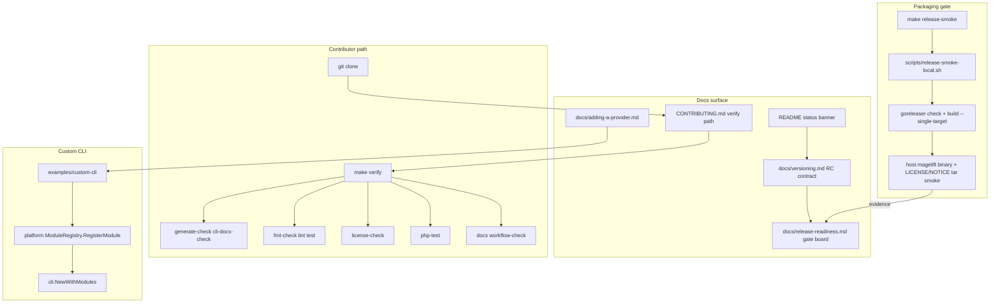

# Phase 2: Tag-Ready Release Surface - Research

**Researched:** 2026-07-28
**Domain:** Release versioning, packaging smoke, contributor onboarding, community provider registration
**Confidence:** HIGH (codebase + SemVer/Go official docs); MEDIUM on exact RC stability wording and packaging-smoke wall-clock on idle Mac

<user_constraints>
## User Constraints (from CONTEXT.md)

### Locked Decisions
1. First public tag is `v1.0.0-rc.1` — named in README, docs/versioning.md, docs/release-readiness.md; strip remaining pre-alpha / v0.x product claims (CHANGELOG history excepted).
2. `docs/versioning.md` must include an RC stability statement for `sdk/v1` and `platform.StackModule`, explicitly reserving shared-Kubernetes port changes for Phase 6.
3. Packaging gate closes via `make release-smoke` / `./scripts/release-smoke-local.sh` — serial, single-target only (AGENTS.md). Record run date + output on the release-readiness board. Prefer plain Terminal for the heavy smoke; agents may prepare the script/docs but must not parallelize goreleaser.
4. CONTRIBUTING.md alone must take a fresh clone to green `make verify` (or honest substitute when hosted CI minutes are still exhausted — document the Phase 1 HUMAN_GATE: Actions minutes deferred; local verify path must be accurate).
5. `examples/custom-cli` + `docs/adding-a-provider.md` alone must register an out-of-tree provider from a clean module cache (no consulting core source during the verification).
6. RELEASE-05 (full gate-board Close/Defer on tag day) stays Phase 8 — out of Phase 2 scope.
7. Phase 1 hosted CI green remains HUMAN_GATE / deferred; Phase 2 proceeds under that accepted deferral per maintainer direction 2026-07-28.

### Claude's Discretion
- How to split plans across docs vs packaging vs contributor-path vs custom-cli verification
- Exact wording of stability statement as long as Phase 6 reservation is explicit
- Whether packaging-smoke evidence is committed as a snippet file vs board table row only

### Deferred Ideas (OUT OF SCOPE)
- Hosted force-all CI proof (Phase 1 QUALITY-06) until Actions minutes return
- RELEASE-05 tag-day board audit → Phase 8
- F-01-07-1 search-proxy DependsOn → later correctness / Phase 6 adjacency
</user_constraints>

<phase_requirements>
## Phase Requirements

| ID | Description | Research Support |
|----|-------------|------------------|
| RELEASE-01 | Version story consistent: first public tag `v1.0.0-rc.1`; no pre-alpha / `v0.x` product claims in the named surfaces | Current language audit + rewrite map (README / versioning / release-readiness; satellite pre-alpha in CONTRIBUTING/SUPPORT/SECURITY) |
| RELEASE-02 | RC stability statement for `sdk/v1` and `platform.StackModule`; reserve Phase 6 shared-Kubernetes port changes | SemVer pre-release semantics + platform surface inventory + Phase 6 ROADMAP reservation |
| RELEASE-03 | Third party follows `docs/adding-a-provider.md` + `examples/custom-cli` without reading core source | Custom-cli / Go `internal` boundary analysis + clean-`GOMODCACHE` verification recipe |
| RELEASE-04 | `make release-smoke` completes (serial, single-target, outside Cursor); packaging gate Partial → Closed | Existing script + `.goreleaser.yaml` + Partial board evidence + OOM risk protocol |
| RELEASE-06 | Fresh clone → green `make verify` via CONTRIBUTING alone (honest when CI deferred) | Makefile verify chain + Phase 1 HUMAN_GATE + local toolchain gaps (PHP/Composer missing on research host) |
</phase_requirements>

## Summary

Phase 2 is documentation-and-evidence work on an already-wired packaging and contributor surface. The version story is still frozen on a **pre-alpha / `v0.x`** narrative (`README.md`, `docs/versioning.md`, gate board “Contract freeze (`v0.x`)”), while the milestone goal and CONTEXT lock the first public tag at **`v1.0.0-rc.1`**. Packaging smoke is already scripted correctly for a 16 GB Mac (`scripts/release-smoke-local.sh`: `goreleaser check` + `build --snapshot --single-target --parallelism=1` with `GOMAXPROCS=1` / `GOFLAGS=-p=1`) but the gate remains **Partial** because a host binary build was aborted under Cursor on 2026-07-22. Contributor and custom-cli paths exist, but CONTRIBUTING still says “pre-alpha” and does not disclose the Phase 1 hosted-CI deferral or the full `make verify` toolchain prerequisites; `examples/custom-cli` is an in-module template that imports `internal/*`, so “out-of-tree” must be defined honestly for verification (custom binary / not in `cmd/magelift`, not a separate Go module importing `internal/platform`).

**Primary recommendation:** Four plans in three waves — (1) version story + RC contract docs, (2) CONTRIBUTING honesty + custom-cli clean-cache proof, (3) human Terminal packaging smoke + board Close — with no new Go dependencies and no hosted Actions.

## Architectural Responsibility Map

| Capability | Primary Tier | Secondary Tier | Rationale |
|------------|-------------|----------------|-----------|
| Version / RC narrative | CDN / Static (docs) | — | Product claims live in README + MkDocs; no runtime feature |
| `sdk/v1` + `platform.StackModule` stability contract | API / Backend (documented contract) | Docs | Contract is the Go ports; statement is documentation of allowed RC churn |
| Packaging smoke / archives | Build / Release tooling | Docs (gate board evidence) | GoReleaser produces binaries; board records Closed |
| Contributor `make verify` path | Developer tooling | Docs (CONTRIBUTING) | Local Makefile gate; CI is deferred substitute narrative |
| Out-of-tree provider registration | API / Backend (compile-time) | Docs + example main | Custom `main` links modules; no dynamic plugins (ADR 0007) |

## Project Constraints (from .cursor/rules/)

From `.cursor/rules/serial-builds-only.mdc` and `AGENTS.md` [VERIFIED: repo]:

- Local packaging smoke: **only** `./scripts/release-smoke-local.sh` or `make release-smoke` (`--single-target --parallelism=1`, `GOMAXPROCS=1`, `GOFLAGS=-p=1`).
- Never full multi-platform `goreleaser release` / snapshot matrix on this Mac; never raise `--parallelism` above 1.
- At most one `go build` at a time; no concurrent agent builds under Cursor.
- If swap climbs during smoke: **abort immediately**; re-run in plain Terminal; do not retry under Cursor.
- Orphan `go tool compile` reap only when no intentional build is running.

## Standard Stack

### Core

| Library / Tool | Version | Purpose | Why Standard |
|----------------|---------|---------|--------------|
| Go | 1.26.0 (`go.mod`) / host `go1.26.5` | Module + tests | Project toolchain [VERIFIED: go.mod, `go version`] |
| GoReleaser | `github.com/goreleaser/goreleaser/v2@v2.12.7` (script pin) | Packaging smoke + release archives | Already used by `release-smoke-local.sh` [VERIFIED: scripts/release-smoke-local.sh] |
| Make | GNU Make 3.81 (host) | `verify`, `release-smoke` | Canonical contributor entry [VERIFIED: Makefile] |
| golangci-lint | `@v2.12.2` via `go run` | Part of `make verify` | Makefile pin [VERIFIED: Makefile] |
| go-licenses | `@v2.0.1` via `go run` | License gate | Makefile pin [VERIFIED: Makefile] |
| actionlint | `@v1.7.12` via `go run` | Workflow syntax in verify | Makefile pin [VERIFIED: Makefile] |
| MkDocs | 1.6.1 (host) | `make docs` | Strict docs build [VERIFIED: `mkdocs --version`] |

### Supporting

| Tool | Version | Purpose | When to Use |
|------|---------|---------|-------------|
| nektos/act | present on host | Local Go CI substitute | Document as optional offline CI stand-in; not a substitute for RELEASE-06 green `make verify` |
| Docker | 29.6.2 | Floci / images (not in `make verify`) | Outside Phase 2 success criteria |
| PHP + Composer | **missing on research host** | `make php-test` inside `make verify` | RELEASE-06 must list as required or provide honest partial path |

### Alternatives Considered

| Instead of | Could Use | Tradeoff |
|------------|-----------|----------|
| Closing packaging via local serial smoke | Wait for CI release job | Hosted minutes exhausted; violates offline Phase 2 |
| Exporting `platform` to a public package | Keep custom-cli in-module | Export is large API work; not required if RELEASE-03 verification is defined as in-module custom binary |
| Claiming hosted CI green in CONTRIBUTING | Honest HUMAN_GATE + local `make verify` | False green is the primary trust risk |

**Installation:** None — Phase 2 installs no new modules. Use existing pins.

**Version verification:** GoReleaser flags `--single-target`, `--snapshot`, `--parallelism` confirmed against GoReleaser docs [CITED: goreleaser.com quick-start / build flags]. SemVer pre-release semantics confirmed [CITED: https://semver.org/].

## Package Legitimacy Audit

> No external packages are added in this phase. Existing tools are invoked via pinned `go run …@version` already in-repo.

| Package | Registry | Age | Downloads | Source Repo | Verdict | Disposition |
|---------|----------|-----|-----------|-------------|---------|-------------|
| — | — | — | — | — | N/A | No new installs |

**Packages removed due to [SLOP] verdict:** none
**Packages flagged as suspicious [SUS]:** none

## Architecture Patterns

### System Architecture Diagram



### Recommended Project Structure (touch set)

```
README.md                          # status banner → v1.0.0-rc.1
docs/versioning.md                 # RC stability + Phase 6 reservation
docs/release-readiness.md          # board: contract row + packaging Closed
CONTRIBUTING.md                    # verify honesty + prerequisites
SUPPORT.md / SECURITY.md           # strip pre-alpha product claims (decision 1)
docs/adding-a-provider.md          # clean-cache verification steps
examples/custom-cli/README.md      # same verification recipe
examples/custom-cli/main.go        # only if stub/comments needed for clarity
scripts/release-smoke-local.sh     # touch only if evidence/logging helpers needed
.goreleaser.yaml                   # no matrix change required for gate Close
```

### Pattern 1: Serial packaging smoke
**What:** `goreleaser check` then host-only `goreleaser build --snapshot --clean --single-target --parallelism=1` under `GOMAXPROCS=1` `GOFLAGS=-p=1`, then assert binary + LICENSE/NOTICE in a smoke tarball.
**When to use:** Closing RELEASE-04; any local packaging validation.
**Example:** See `scripts/release-smoke-local.sh` [VERIFIED: file].

### Pattern 2: Clean module-cache custom-cli proof
**What:** Empty `GOMODCACHE` (and preferably `GOCACHE`), build `./examples/custom-cli` following docs only, run `version`.
**When to use:** RELEASE-03 verification.
**Example:**
```bash
# Source: Phase 2 research recommendation (Go modules layout + existing example)
export GOMODCACHE="$(mktemp -d /tmp/magelift-modcache.XXXXXX)"
export GOCACHE="$(mktemp -d /tmp/magelift-gocache.XXXXXX)"
GOMAXPROCS=1 GOFLAGS=-p=1 go build -o /tmp/magelift-ext ./examples/custom-cli
/tmp/magelift-ext version
```

### Pattern 3: Honest local vs CI verify narrative
**What:** CONTRIBUTING documents (a) required toolchains for full `make verify`, (b) Phase 1 HUMAN_GATE that hosted force-all CI is deferred, (c) optional `make ci-act-go` as Go-only local stand-in — never claim “CI green on main” until minutes return.
**When to use:** RELEASE-06.

### Anti-Patterns to Avoid
- **Claiming packaging Closed from `goreleaser check` alone:** Board already recorded check green; host binary build is the remaining Partial [VERIFIED: docs/release-readiness.md].
- **Running release-smoke under Cursor:** Prior abort at ~2.3 GB swap [VERIFIED: docs/release-readiness.md Packaging smoke record].
- **Overclaiming separate-module community providers:** Separate modules cannot import `internal/platform` [CITED: https://go.dev/doc/modules/layout].
- **Updating QUALITY-06 / hosted CI as Phase 2 work:** Explicitly deferred [VERIFIED: CONTEXT + 01-VERIFICATION.md].

## Don't Hand-Roll

| Problem | Don't Build | Use Instead | Why |
|---------|-------------|-------------|-----|
| Multi-arch release packaging | Custom shell cross-compile matrix | Existing `release-smoke-local.sh` + CI GoReleaser | Parallel matrix OOMs this Mac; CI owns full matrix |
| Dynamic provider plugins | Plugin ABI / unsigned download | Compile-time `RegisterModule` (ADR 0007) | Supply-chain + already decided |
| SemVer inventiveness | Ad-hoc “v0 freeze” story | SemVer 2.0 pre-release + explicit RC contract doc | First tag is `v1.0.0-rc.1` |
| CI minutes proof | Fake green badge language | HUMAN_GATE honesty in CONTRIBUTING / lint-policy | Minutes exhausted 2026-07-28 |

**Key insight:** Phase 2 closes trust surfaces (docs + evidence), not new infrastructure. Reuse scripts; write honest contracts.

## Common Pitfalls

### Pitfall 1: False “green verify” claims
**What goes wrong:** CONTRIBUTING or README implies clone→CI-green while QUALITY-06 hosted outcome is still HUMAN_GATE.
**Why it happens:** Phase 1 deferred CI; REQUIREMENTS still marks QUALITY-06 Complete prematurely [VERIFIED: 01-VERIFICATION.md note].
**How to avoid:** Explicit “local `make verify` is the gate; hosted force-all deferred until Actions minutes return” with pointer to `docs/lint-policy.md` deferred-ci and `.planning/loop/HUMAN_GATE`.
**Warning signs:** Language like “CI is green on main” or omitting PHP/Composer/MkDocs from prerequisites.

### Pitfall 2: OOM / kernel panic on packaging smoke
**What goes wrong:** Full GoReleaser matrix or Cursor+smoke exhausts RAM/SWAP.
**Why it happens:** Six GOOS/GOARCH targets × default parallelism × Pulumi-linked binary [VERIFIED: docs/knowledge/reference/Build and release on 16GB…].
**How to avoid:** Only `make release-smoke`; plain Terminal; abort on swap climb; never raise parallelism.
**Warning signs:** Swap climbing, machine crawl, orphan `go tool compile` processes.

### Pitfall 3: Leaving `v0.x` freeze language
**What goes wrong:** versioning.md still titled “`v0.x` freeze surface” and gate board still “Contract freeze (`v0.x`)” after README flip.
**Why it happens:** Three surfaces updated unevenly.
**How to avoid:** Single plan owning README + versioning.md + release-readiness contract/packaging rows; grep for `pre-alpha` and `v0.x` product claims (CHANGELOG history excepted).
**Warning signs:** Grep still hits README/versioning/release-readiness for pre-alpha.

### Pitfall 4: Defining RELEASE-03 as a separate Go module
**What goes wrong:** Plan tries to publish `github.com/…/magelift-provider-foo` importing `platform.StackModule` and fails compile.
**Why it happens:** ADR 0007 says “sdk/v1 contracts” but registration uses `internal/platform` + `internal/cli` [VERIFIED: examples/custom-cli/main.go, go.dev internal rules].
**How to avoid:** Verify via in-module `examples/custom-cli` + docs; document that true separate-module providers need a future public export (out of Phase 2) OR must live as a fork/custom binary of this module.
**Warning signs:** Plan tasks titled “publish external module to proxy.golang.org”.

### Pitfall 5: Closing the whole gate board (RELEASE-05)
**What goes wrong:** Phase 2 tries to Close/Defer every row.
**Why it happens:** Confusing packaging Close with tag-day audit.
**How to avoid:** Only packaging (+ contract freeze wording) rows for Phase 2; RELEASE-05 → Phase 8.

## Code Examples

### Release-smoke (canonical)
```bash
# Source: scripts/release-smoke-local.sh + Makefile release-smoke
make release-smoke
# Prefer: plain Terminal, machine idle, Cursor quit or closed
```

### Makefile verify chain (contributor gate)
```make
# Source: Makefile
verify: generate-check cli-docs-check fmt-check lint test license-check php-test docs workflow-check
```

### Custom CLI registration seam
```go
// Source: examples/custom-cli/main.go
modules := platform.NewModuleRegistry()
for _, module := range []platform.StackModule{
    awsops.Module{},
    // community.Module{},
} {
    if err := modules.RegisterModule(module); err != nil {
        fail(err)
    }
}
if err := cli.NewWithModules(modules).Execute(); err != nil { /* … */ }
```

## Current State Audit (gaps vs RELEASE-01..04,06)

### Version language (RELEASE-01)

| File | Current claim | Gap |
|------|---------------|-----|
| `README.md` L7–10 | “pre-alpha until first public `v0.x` tag” | Must name `v1.0.0-rc.1`; remove pre-alpha / v0.x product claim |
| `docs/versioning.md` | Allows README pre-alpha; “`v0.x` freeze surface”; “After `v0.1.0`” | Rewrite around RC.1 + RC freeze surface |
| `docs/release-readiness.md` | Gate “Contract freeze (`v0.x`) **Closed**”; Packaging **Partial** | Rename contract row; packaging remains Partial until smoke |
| `CONTRIBUTING.md` L3 | “pre-alpha” | Strip per locked decision 1 (satellite claim) |
| `SUPPORT.md` / `SECURITY.md` | “pre-alpha” | Strip product claims (same decision) |
| `CHANGELOG.md` Unreleased | “first public `v0.x` line” | History excepted for past notes; **Unreleased forward claim should align** to RC.1 [ASSUMED: planner should update Unreleased, leave only true historical entries if any] |

### RC stability (RELEASE-02)

- No stability statement for `sdk/v1` / `platform.StackModule` RC series today [VERIFIED: docs/versioning.md contents].
- Phase 6 will consolidate Observe + `deploy.Steps` into `internal/cloud/kube` — must be **explicitly reserved** as allowed RC churn affecting Kubernetes-shaped modules [VERIFIED: ROADMAP Phase 6].
- SemVer: `1.0.0-rc.1` is a pre-release and “might not satisfy the intended compatibility requirements” of `1.0.0` [CITED: semver.org] — the project contract must state what **is** stable during RCs vs what may change.

**Recommended stability shape (discretion — wording free):**
- Stable during RC: `magelift.yaml` schemaVersion additive rules; CLI verb names; exit codes; provider ID strings; certified AWS ECS cells honesty labels; `sdk/v1` Target/Capability/Hook shapes unless a documented RC break note.
- May change during RC: experimental providers; day-2 port shapes on Kubernetes targets pending Phase 6 shared `internal/cloud/kube`; experimental cells returning `ErrNotSupported`.
- Explicit reservation: shared-Kubernetes Observe / deploy.Steps consolidation (Phase 6) may change `platform` port wiring for EKS/GKE/MKS/Kapsule modules without waiting for `v2`.

### Packaging (RELEASE-04)

**Already present:**
- `.goreleaser.yaml`: linux/darwin/windows × amd64/arm64, archives with LICENSE/NOTICE/README, checksums, SBOM, cosign, homebrew cask [VERIFIED].
- `scripts/release-smoke-local.sh` + `make release-smoke` serial host smoke [VERIFIED].
- Board documents Partial + abort record 2026-07-22 [VERIFIED].

**Needed to Close:**
1. Successful full script run in plain Terminal (human-gated).
2. Board row → **Closed** with date + output snippet (table row sufficient; optional committed snippet under discretion).
3. No script flag changes required unless logging/evidence helper desired.

### Custom-cli (RELEASE-03)

**Present:** `docs/adding-a-provider.md` checklist + `examples/custom-cli` registering first-party modules with commented community slot [VERIFIED].

**Gaps:**
- Docs do not prescribe clean-`GOMODCACHE` verification.
- Example does not demonstrate a stub community `StackModule` (only a comment) — may be enough if docs say “uncomment and implement,” but verification needs a **buildable** path that proves registration without reading core. Building the existing example (registers AWS/EKS/GCP modules) proves the registration seam; optional tiny stub module in the example package would make “community” literal.
- ADR 0007 vs reality: separate modules cannot import `internal/platform` — docs must not overclaim [CITED: go.dev/doc/modules/layout].

### Contributor path (RELEASE-06)

**Present:** CONTRIBUTING points to `make verify` [VERIFIED].

**Gaps:**
- Does not list toolchain prerequisites for full verify (Go from go.mod, PHP 8.2+, Composer, MkDocs, golangci via `go run`).
- Research host: **PHP and Composer missing** → full `make verify` cannot succeed here until installed [VERIFIED: `command -v`].
- No mention of Phase 1 HUMAN_GATE / deferred Actions force-all.
- Fresh-clone proof not yet recorded; planner should require a clean worktree/clone run once toolchains are present.

## Recommended Plan Wave Split

**Recommended: 4 plans / 3 waves**

| Plan | Wave | Owns | Reqs |
|------|------|------|------|
| 02-01 Version story + RC contract | 1 | README, versioning.md, release-readiness contract row, SUPPORT/SECURITY/CONTRIBUTING pre-alpha strip, Unreleased CHANGELOG align | RELEASE-01, RELEASE-02 |
| 02-02 CONTRIBUTING verify honesty | 2 | Prerequisites, local vs deferred CI, optional act note, fresh-clone verify procedure | RELEASE-06 |
| 02-03 Custom-cli clean-cache proof | 2 | adding-a-provider.md + custom-cli README verification recipe; optional stub; honesty about `internal` | RELEASE-03 |
| 02-04 Packaging smoke Close | 3 | `checkpoint:human-verify` plain Terminal `make release-smoke`; board Partial→Closed + evidence | RELEASE-04 |

Wave 2 plans are parallelizable (`parallelization: true`) if toolchains allow; Wave 3 depends on human availability and idle machine (not on Wave 2 code).

## State of the Art

| Old Approach | Current Approach | When Changed | Impact |
|--------------|------------------|--------------|--------|
| Pre-alpha / `v0.x` first tag story | First public tag `v1.0.0-rc.1` | Milestone decision 2026-07 | Docs rewrite required |
| Full local goreleaser matrix | Serial `--single-target` smoke | 2026-07-22 post-panic | Packaging gate closable offline |
| Monolithic CI lint | Partitioned lint + deferred hosted green | Phase 1 | CONTRIBUTING must stay honest |

**Deprecated/outdated:**
- “Contract freeze (`v0.x`)” as the public first-tag framing.
- Claiming brew/tag blocked by pre-alpha freeze (knowledge lesson 2026-07-19) — superseded by RC.1 milestone.

## Assumptions Log

| # | Claim | Section | Risk if Wrong |
|---|-------|---------|---------------|
| A1 | Unreleased CHANGELOG forward `v0.x` claim should be rewritten even though “CHANGELOG history excepted” | Current State Audit | Planner might leave contradictory Unreleased text |
| A2 | SUPPORT/SECURITY pre-alpha strips are in scope under locked decision 1 (“remaining … claims”) | Current State Audit | Narrow reading leaves satellite pre-alpha language |
| A3 | RELEASE-03 does not require exporting `platform` in Phase 2 | Pitfall 4 / wave split | Under-delivers if maintainer meant true separate-module providers |
| A4 | Idle-Mac packaging smoke will complete without OOM when Cursor is closed | RELEASE-04 | Gate stays Partial; need another day / more free RAM |

**If empty:** N/A — assumptions listed above need confirmation only if planner disagrees with A3.

## Open Questions

1. **RELEASE-03 depth: stub community module vs build existing example?**
   - What we know: Existing example builds and registers first-party modules; community slot is commented.
   - What's unclear: Whether success criterion 5 requires a literal stub `StackModule` or only the registration path.
   - Recommendation: Prefer minimal stub in `examples/custom-cli` (same package) so docs can say “implement Module{}” without reading core — still in-module.

2. **Packaging evidence format?**
   - Discretion allows snippet file vs board row only.
   - Recommendation: Board table row with date + one-line `release smoke ok binary=…` is enough; avoid committing large `dist/` artifacts.

## Environment Availability

| Dependency | Required By | Available | Version | Fallback |
|------------|------------|-----------|---------|----------|
| Go | verify, release-smoke, custom-cli | ✓ | go1.26.5 | — |
| Make | verify / release-smoke | ✓ | 3.81 | — |
| Docker | floci/images (not Phase 2 SC) | ✓ | 29.6.2 | — |
| MkDocs | `make docs` / verify | ✓ | 1.6.1 | — |
| act | optional CI substitute docs | ✓ | present | Document as optional |
| PHP 8.2+ | `make php-test` / full verify | ✗ | — | Install before RELEASE-06 proof; or document Go-only subset as insufficient for RELEASE-06 |
| Composer | `make php-test` | ✗ | — | Same as PHP |
| GoReleaser binary on PATH | — | ✗ | — | Script uses `go run …@v2.12.7` — fine |
| Paid cloud / Actions minutes | hosted CI | ✗ | exhausted | HUMAN_GATE honesty; local verify + act |

**Missing dependencies with no fallback:**
- PHP + Composer for a true green `make verify` on this research host — planner must include install or run proof on a machine that has them.

**Missing dependencies with fallback:**
- Hosted Actions → local `make verify` + optional `make ci-act-go` (Go subset only).

Step 2.6: Environment probed 2026-07-28 on maintainer Mac.

## Validation Architecture

### Test Framework

| Property | Value |
|----------|-------|
| Framework | Go `testing` + `go test -race` (Makefile `test`) |
| Config file | none (standard Go); PHP: `build/phpunit.xml` |
| Quick run command | `GOMAXPROCS=1 GOFLAGS=-p=1 go test ./internal/platform/ -count=1` |
| Full suite command | `make verify` (serial; heavy) — or targeted subsets |

### Phase Requirements → Test Map

| Req ID | Behavior | Test Type | Automated Command | File Exists? |
|--------|----------|-----------|-------------------|-------------|
| RELEASE-01 | No pre-alpha/`v0.x` product claims in named docs; RC.1 named | smoke / grep gate | `rg -n 'pre-alpha|v0\\.x' README.md docs/versioning.md docs/release-readiness.md` expect no product claims; `rg 'v1\\.0\\.0-rc\\.1' …` | ❌ Wave 0 — add script or plan acceptance checkbox |
| RELEASE-02 | Stability statement + Phase 6 reservation present | doc assert | `rg -n 'StackModule|Phase 6|shared.Kubernetes|sdk/v1' docs/versioning.md` | ❌ Wave 0 — checklist |
| RELEASE-03 | Clean cache build custom-cli | smoke | clean `GOMODCACHE` `go build ./examples/custom-cli` | ❌ Wave 0 — document in plan; optional `scripts/custom-cli-smoke.sh` |
| RELEASE-04 | release-smoke exits 0 | smoke | `make release-smoke` (human Terminal) | ✅ script exists |
| RELEASE-06 | Fresh clone `make verify` | smoke | clean clone + `make verify` | ❌ Wave 0 — procedure only; PHP prerequisite |

### Sampling Rate
- **Per task commit:** doc grep / targeted Go tests if code touched
- **Per wave merge:** relevant smoke (custom-cli or verify subset)
- **Phase gate:** RELEASE-04 smoke Closed + RELEASE-01/02 greps + RELEASE-03 clean-cache build + RELEASE-06 fresh verify (or documented blocker if PHP absent)

### Wave 0 Gaps
- [ ] Optional `scripts/custom-cli-smoke.sh` — clean GOMODCACHE build (nice-to-have; docs steps may suffice)
- [ ] Grep/checklist acceptance for version-language (can live in PLAN verification, not necessarily a repo script)
- [ ] Ensure PHP+Composer available before executing RELEASE-06 proof
- [ ] Framework install: none for Go; `brew install php composer` (or equivalent) if proving verify on this Mac

## Security Domain

### Applicable ASVS Categories

| ASVS Category | Applies | Standard Control |
|---------------|---------|-----------------|
| V2 Authentication | no | — |
| V3 Session Management | no | — |
| V4 Access Control | no | — |
| V5 Input Validation | yes (light) | Doc/config accuracy; no new parsers |
| V6 Cryptography | no (Phase 2) | Cosign already in release pipeline — do not hand-roll; smoke does not re-sign |

### Known Threat Patterns for release-surface work

| Pattern | STRIDE | Standard Mitigation |
|---------|--------|---------------------|
| False readiness / social trust failure | Spoofing / Repudiation | Honest HUMAN_GATE language; no fake CI green |
| Supply chain via new deps | Tampering | Install no new packages this phase |
| Unsigned community plugins | Tampering | Keep compile-time RegisterModule only (ADR 0007) |
| Secret leakage in smoke evidence | Information disclosure | Record command output only; no credentials; no `dist/` binaries in git |

## Sources

### Primary (HIGH confidence)
- Repo files: README.md, docs/versioning.md, docs/release-readiness.md, CONTRIBUTING.md, Makefile, scripts/release-smoke-local.sh, .goreleaser.yaml, examples/custom-cli/*, docs/adding-a-provider.md, .planning/CONTEXT/REQUIREMENTS/ROADMAP, 01-VERIFICATION.md
- https://semver.org/ — pre-release semantics
- https://go.dev/doc/modules/layout — `internal/` import boundary
- `.cursor/rules/serial-builds-only.mdc` / AGENTS.md — serial build constraint

### Secondary (MEDIUM confidence)
- https://goreleaser.com/getting-started/quick-start/ — `--single-target` / snapshot usage
- GoReleaser GOMAXPROCS / `--parallelism` docs — confirms env inheritance into `go build`
- docs/knowledge/reference/Build and release on 16GB… — historical OOM evidence

### Tertiary (LOW confidence)
- Exact idle-Mac wall-clock / peak RSS for full release-smoke — not re-measured this session (prior abort under Cursor only)

## Metadata

**Confidence breakdown:**
- Standard stack: HIGH — pinned in Makefile/scripts; host probed
- Architecture: HIGH — seams verified in code + ADRs
- Pitfalls: HIGH — OOM and false-green documented in-repo; MEDIUM on separate-module interpretation (A3)

**Research date:** 2026-07-28
**Valid until:** 2026-08-28 (stable docs/tooling; re-check if Actions minutes return mid-phase)

## Planner briefing (wave count)

- **Plans:** 4 (`02-01` … `02-04`)
- **Waves:** 3 (docs → contributor+custom-cli → human packaging smoke)
- **Do not write:** RELEASE-05 work, hosted CI force-all, paid cloud
- **Hard gate:** packaging smoke = human plain Terminal only
