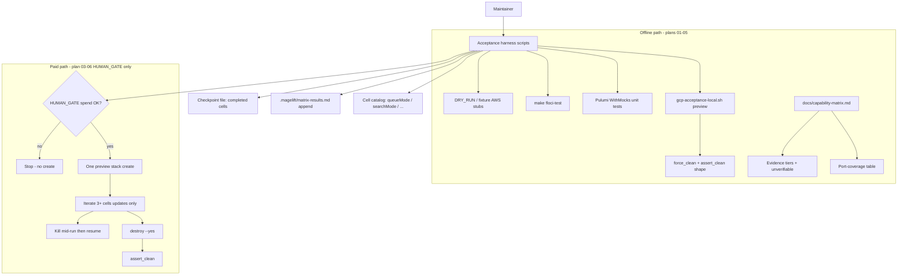

# Phase 3: Credit-Efficient Acceptance Harness & Evidence Tiering - Research

**Researched:** 2026-07-28
**Domain:** Maintainer acceptance harness (bash + Floci + Pulumi mocks), capability-matrix evidence tiers, credit-gated AWS free-tier proof
**Confidence:** HIGH (codebase + existing scripts/docs); MEDIUM on exact Floci coverage for ECS ExecuteCommand / OIDC bootstrap

<user_constraints>
## User Constraints (from CONTEXT.md)

### Locked Decisions
1. One long-lived AWS free-tier preview stack for harness proof (PAID pass 1 of 3) — do not start paid create until HUMAN_GATE confirms spend OK.
2. Offline-first: resume, evidence append, assert_clean, matrix tiering, Floci/mocks, GCP dry-run path — build and test before any paid pass.
3. Capability matrix must not over-claim; Aurora CreateDBCluster, amazon-mq×preview, OpenSearch SigV4 data-plane get explicit unverifiable reasons.
4. Phase 1 hosted CI still deferred; Phase 2 is complete.

### Claude's Discretion
- Plan split offline harness vs paid proof wave
- Stop at HUMAN_GATE before any AWS create that spends money

### Deferred Ideas (OUT OF SCOPE)
- live GCP spend (Phase 7)
- import/migrate
- kube day-2 implementation beyond what harness needs
</user_constraints>

<phase_requirements>
## Phase Requirements

| ID | Description | Research Support |
|----|-------------|------------------|
| ACCEPT-01 | One long-lived stack; iterate catalog cells without recreate between cells | Evolve `scripts/aws-acceptance-local.sh` + KEEP pattern; cell driver; SC#1 create-once proof |
| ACCEPT-02 | Resume interrupted run from last completed cell | New checkpoint file; skip recorded cells (absent today) |
| ACCEPT-03 | Auto-append evidence rows (cell, result, duration, provider, account, date) | Replace hand-typed `.magelift/matrix-results.md`; harness writer |
| ACCEPT-04 | Destroy on exit + `assert_clean` fails loud on leftovers | Existing `assert_clean` in AWS/GCP scripts; dual-outcome offline stubs + live HUMAN_GATE |
| ACCEPT-05 | Same harness shape for GCP incl. PSA soak + force-clean | Extend `scripts/gcp-acceptance-local.sh`; Phase 3 = dry-run/preview only |
| ACCEPT-06 | Mockable day-2 ports covered by Floci/Pulumi mocks | Port-coverage table + Floci gap fill; paid-only marked honestly |
| TRUST-03 | Evidence tier per matrix cell; no over-claim | Update `docs/capability-matrix.md` tiers |
| TRUST-04 | Unverifiable cells with specific reasons | Aurora CreateDBCluster, amazon-mq×preview, OpenSearch SigV4 + AOSS OCU honesty from Phase 1 |
</phase_requirements>

## Summary

Phase 3 turns ad-hoc local acceptance into a **credit-efficient, resumable harness** and makes the capability matrix tell the truth about evidence. The repo already has destroy-on-EXIT scripts (`scripts/aws-acceptance-local.sh`, `scripts/gcp-acceptance-local.sh`) with `assert_clean`, Floci account-free tests (`make floci-test`), Pulumi `WithMocks` graph tests, and a hand-written `.magelift/matrix-results.md` from 2026-07-21. What is **missing** is the productized loop: multi-cell iteration on one stack, checkpoint/resume, automatic evidence append with required columns, a checked-in port-coverage map, per-cell evidence tiers + unverifiable reasons, and a GCP path exercised offline (preview/dry-run) before Phase 7 spends credits.

**Primary recommendation:** Six plans in four waves — offline harness core → assert_clean + matrix honesty → Floci/GCP dry-run → **03-06 HUMAN_GATE paid AWS free-tier proof** (only plan that may create paid resources).

## Recommended Plan Waves

| Wave | Plans | Spend | Delivers |
|------|-------|-------|----------|
| 1 | **03-01** | None | Harness core: cell catalog, checkpoint/resume, evidence append helpers, `MAGELIFT_*_DRY_RUN` / fixture mode; unit tests for resume + append |
| 1 | **03-02** | None | Extract/shared `assert_clean`; offline dual-outcome tests (clean → 0, leftover stub → non-zero); wire EXIT trap to shared helper |
| 2 | **03-03** | None | TRUST-03/04: `docs/capability-matrix.md` evidence tier per cell; unverifiable reasons; checked-in **port-coverage** table |
| 3 | **03-04** | None | ACCEPT-06: close Floci/mock gaps for every port marked mockable; `make floci-test` green for those rows |
| 3 | **03-05** | None | ACCEPT-05 shape: GCP harness shares resume/evidence API; exercise `preview` + force_clean/assert_clean structure **without** `up` |
| 4 | **03-06** | **PAID — HUMAN_GATE** | Live AWS free-tier `preview` proof: ≥3 cells one stack, kill+resume, auto evidence, destroy + assert_clean both outcomes |

**Paid HUMAN_GATE plan:** `03-06` — do not start AWS create until human confirms spend OK. Plans 03-01…03-05 must be green first.

## Architectural Responsibility Map

| Capability | Primary Tier | Secondary Tier | Rationale |
|------------|-------------|----------------|-----------|
| Cell catalog + resume checkpoint | Developer tooling (scripts) | Local file under `.magelift/` | Maintainer harness, not product runtime |
| Evidence append (`matrix-results.md`) | Developer tooling | Docs (capability-matrix cites tiers) | Harness writes evidence; docs claim tiers |
| `assert_clean` / destroy EXIT trap | Developer tooling | Cloud account APIs (aws/gcloud CLI) | Account hygiene gate |
| Floci day-2 port coverage | Test / emulator | API adapters under `internal/cloud/aws` | Offline AWS API contracts |
| Pulumi graph mocks | Unit test (Go) | Stack components | Composition without cloud |
| Capability matrix evidence tiers | CDN / Static (docs) | Release-readiness board | TRUST-03/04 honesty surface |
| Paid AWS free-tier proof | Cloud account (AWS) | Harness scripts | Only after HUMAN_GATE |
| GCP harness dry-run | Developer tooling | GCP APIs only in Phase 7 | Phase 3 stops at preview/force_clean shape |

## Project Constraints (from .cursor/rules/)

From `.cursor/rules/serial-builds-only.mdc` and `AGENTS.md` [VERIFIED: repo]:

- Never parallel `go build` / goreleaser / docker buildx on this 16 GB Mac.
- `make floci-test` / `go test` must stay serial (`GOMAXPROCS=1` / `-p=1` when agents run builds); at most one intentional compile at a time.
- Do **not** spend cloud money in plans 03-01…03-05; 03-06 is HUMAN_GATE.
- Prefer Floci + Pulumi mocks for day-to-day; real AWS only for certification gates [VERIFIED: docs/knowledge/lessons/MageLift day-to-day testing uses Floci and mock Pulumi not full cloud Up.md].

## Standard Stack

### Core

| Library / Tool | Version | Purpose | Why Standard |
|----------------|---------|---------|--------------|
| Bash + Make | host bash / GNU Make | Acceptance harness scripts | Existing `aws-acceptance-local` / `gcp-acceptance-local` / `floci-test` [VERIFIED: Makefile, scripts/] |
| Go | 1.26.0 (`go.mod`) / host `go1.26.5` | Floci tests, Pulumi mocks, any small harness helpers | Project toolchain [VERIFIED: go.mod, `go version`] |
| Floci | `floci/floci:1.5.33@sha256:d2ecc803…` | Account-free AWS API contracts | Pinned in `docker-compose.floci.yml`; Keep-Floci decision [VERIFIED: docker-compose.floci.yml] [CITED: https://floci.io/] |
| Pulumi Go SDK | host CLI `v3.254.0` | `pulumi.WithMocks` graph tests | Already used across `*_test.go` [VERIFIED: codebase] [CITED: https://www.pulumi.com/docs/iac/guides/testing/unit/] |
| aws-cli | host `2.36.9` | `assert_clean` queries | Used by `scripts/aws-acceptance-local.sh` [VERIFIED: script + `aws --version`] |
| gcloud | host `576.0.0` | GCP assert_clean / force_clean | Used by `scripts/gcp-acceptance-local.sh` [VERIFIED: script + `gcloud --version`] |
| Docker | `29.6.2` | Floci compose | Required for `make floci-test` [VERIFIED: `docker --version`] |

### Supporting

| Tool | Version | Purpose | When to Use |
|------|---------|---------|-------------|
| `jq` | host | Parse magelift JSON / Pulumi export in GCP script | GCP harness already depends on it [VERIFIED: gcp-acceptance-local.sh] |
| Cosign / signed digest | maintainer-supplied | Real AWS promote/deploy cell | Only 03-06 HUMAN_GATE [VERIFIED: docs/aws-acceptance.md] |

### Alternatives Considered

| Instead of | Could Use | Tradeoff |
|------------|-----------|----------|
| Floci | LocalStack / Ministack | Rejected — Keep Floci decision [VERIFIED: Keep Floci over Ministack lesson] |
| Bash harness | Full Go CLI subcommand `magelift accept` | Larger surface; Phase 3 needs credit efficiency not product CLI; bash evolves existing scripts |
| Hosted AWS Actions matrix | Local HUMAN_GATE script | Spend-gated CI was removed; local is the certified path [VERIFIED: local AWS acceptance replaces CI matrix lesson] |
| Committing `.magelift/matrix-results.md` | Keep gitignored + cite from board | `.magelift/` is gitignored [VERIFIED: .gitignore]; harness still writes there; TRUST tiers live in committed `docs/capability-matrix.md` |

**Installation:** None — Phase 3 installs **no new Go modules**. Use existing pins + shell.

**Version verification:** Floci image pin and Pulumi CLI version confirmed on research host 2026-07-28. No npm/PyPI/crates packages proposed.

## Package Legitimacy Audit

> No external packages are installed in this phase.

| Package | Registry | Age | Downloads | Source Repo | Verdict | Disposition |
|---------|----------|-----|-----------|-------------|---------|-------------|
| — | — | — | — | — | N/A | No installs |

**Packages removed due to [SLOP] verdict:** none  
**Packages flagged as suspicious [SUS]:** none

## Architecture Patterns

### System Architecture Diagram



### Recommended Project Structure

```
scripts/
├── aws-acceptance-local.sh      # Evolve: cells + resume + evidence + KEEP
├── gcp-acceptance-local.sh      # Evolve: same shape; Phase 3 = preview/dry-run
├── acceptance/                  # NEW shared helpers (recommended)
│   ├── lib-evidence.sh          # append_row(cell,result,duration,provider,account,date)
│   ├── lib-checkpoint.sh        # load/save/skip completed cells
│   ├── lib-assert-clean-aws.sh  # extract from aws-acceptance-local
│   └── cells-aws-preview.txt    # ordered free-tier cell list
tests/
├── floci/                       # Existing + gap fills for ACCEPT-06
└── acceptance/                  # NEW: offline harness unit tests (bash or Go)
    ├── evidence_append_test.*
    ├── checkpoint_resume_test.*
    └── assert_clean_stub_test.*
docs/
└── capability-matrix.md         # Evidence tiers + port-coverage + unverifiable
.magelift/                       # gitignored runtime evidence + checkpoint
├── matrix-results.md
├── acceptance-checkpoint.json   # NEW
└── gcp-matrix/...
```

### Pattern 1: Checkpoint / resume
**What:** Persist completed cell IDs + result to a JSON/TSV under `.magelift/`; on start, skip those IDs and continue at first incomplete. [ASSUMED: file format — recommend JSON `{"cells":{"queueMode:db":{"result":"PASS","at":"..."}}}`]
**When to use:** Every multi-cell acceptance run (ACCEPT-02).
**Example:**
```bash
# Pseudocode — Source: research recommendation (no upstream lib)
cell_done() { jq -e --arg c "$1" '.cells[$c]' "$CHECKPOINT" >/dev/null 2>&1; }
for cell in "${CELLS[@]}"; do
  cell_done "$cell" && { printf 'skip %s\n' "$cell"; continue; }
  run_cell "$cell" || record_fail "$cell"
  record_pass "$cell"
done
```

### Pattern 2: Evidence append (never hand-type)
**What:** One function appends a markdown table row with required columns. Harness is the only writer for new rows (ACCEPT-03).
**When to use:** After each cell completes (pass/fail/skip-with-reason).
**Example columns (locked by ROADMAP SC#2):** `cell | result | duration | provider | account | date`

### Pattern 3: Offline assert_clean dual outcome
**What:** Wrap `aws` (or inject stub) so describe queries return `0` vs `1+`; assert exit codes without an account (ACCEPT-04 offline half).
**When to use:** Plans 03-02 tests; live leftover proof only in 03-06.

### Pattern 4: Pulumi WithMocks for graph-only cells
**What:** `pulumi.RunErr(..., pulumi.WithMocks(...))` for composition claims that must not spend. [CITED: https://www.pulumi.com/docs/iac/guides/testing/unit/] [VERIFIED: existing `internal/cloud/**/*_test.go`]
**When to use:** Cells marked evidence tier `Pulumi mocks` in the matrix.

### Anti-Patterns to Avoid
- **Creating AWS resources in plans 01–05:** Violates CONTEXT locked decision #1/#2.
- **Hand-editing matrix-results as “proof”:** Fails ACCEPT-03 / SC#2.
- **Claiming Floci certifies IAM/OIDC or live OpenSearch SigV4:** Floci does not certify IAM; OpenSearch live SigV4 is deferred [VERIFIED: Floci lessons + release-readiness].
- **Re-create between cells:** KEEP=true + update/deploy per cell; one destroy at end (ACCEPT-01).
- **GCP `up` in Phase 3:** Live GCP spend is Phase 7 (CONTEXT deferred).

## Don't Hand-Roll

| Problem | Don't Build | Use Instead | Why |
|---------|-------------|-------------|-----|
| AWS API offline | Custom stub server | Floci (`make floci-test`) | Already pinned; Keep-Floci decision |
| Pulumi graph checks | Live `pulumi up` | `pulumi.WithMocks` | Official unit-test path; free |
| Account leftover scan | Ad-hoc console clicks | Shared `assert_clean` helper | Already coded in both scripts |
| Evidence store | New DB/service | Append-only markdown under `.magelift/` | Matches ROADMAP SC + existing practice |
| Multi-cloud CI spend | GitHub Actions AWS matrix | Local HUMAN_GATE scripts | CI matrix removed by design |

**Key insight:** The expensive mistakes are recreating stacks per cell and re-running paid passes that mocks already cover. Offline work must buy everything Floci/mocks can buy before 03-06 spends.

## Common Pitfalls

### Pitfall 1: Spending before resume/evidence exist
**What goes wrong:** Paid stack proves nothing about ACCEPT-02/03; credits wasted on re-runs.  
**Why it happens:** Temptation to “just run the old script once.”  
**How to avoid:** Wave order; 03-06 blocked on offline green.  
**Warning signs:** HUMAN_GATE opened while checkpoint tests missing.

### Pitfall 2: Over-claiming matrix tiers
**What goes wrong:** Cell marked certified/Floci when only mocks exist (TRUST-03).  
**Why it happens:** Evidence tiers section today is thin; catalog table mixes “Certified” with unverifiable free-tier reality.  
**How to avoid:** Per-cell tier column + explicit unverifiable reasons (TRUST-04).  
**Warning signs:** Aurora / amazon-mq×preview / OpenSearch SigV4 without “unverifiable” text.

### Pitfall 3: Stale ECS cluster name after broker replace
**What goes wrong:** False FAIL on day-2 cells after queueMode swap.  
**Why it happens:** Documented in hand matrix-results 2026-07-21.  
**How to avoid:** Dynamic cluster/service lookup from `magelift outputs` each cell.  
**Warning signs:** Hard-coded cluster names in harness.

### Pitfall 4: Killing mid-deploy without lock hygiene
**What goes wrong:** Orphan DIY locks / pending_operations; next resume stuck.  
**Why it happens:** Known lesson on stale Pulumi DIY locks.  
**How to avoid:** Resume docs + safe unlock only when account empty; never kill mid-create on paid pass without recovery steps.  
**Warning signs:** `magelift deploy` refuses with lock held after kill.

### Pitfall 5: GCP PSA teardown races
**What goes wrong:** assert_clean fails; VPC leftovers after Cloud SQL soft-delete.  
**Why it happens:** Producer lag before peering delete [VERIFIED: GCP force_clean lesson].  
**How to avoid:** Reuse existing soak + force_clean; Phase 3 only proves shape offline / preview.  
**Warning signs:** Running `up` “just to test force_clean” in Phase 3.

### Pitfall 6: Parallel builds during Floci/test
**What goes wrong:** Kernel panic / OOM on 16 GB Mac.  
**How to avoid:** Serial builds only (AGENTS.md).

## Code Examples

### Pulumi WithMocks (existing project pattern)
```go
// Source: https://www.pulumi.com/docs/iac/guides/testing/unit/
// Also: internal/cloud/aws/network/network_test.go (repo)
err := pulumi.RunErr(func(ctx *pulumi.Context) error {
	_, err := New(ctx, "shop", args)
	return err
}, pulumi.WithMocks("project", "stack", mocks))
```

### Existing AWS assert_clean shape (extract, don't rewrite)
```bash
# Source: scripts/aws-acceptance-local.sh:39-74
count=$(aws ec2 describe-vpcs --region "$region" \
  --filters "Name=tag:magelift:project,Values=$project_tag" \
  --query 'length(Vpcs)' --output text)
[[ "$count" == "0" ]] || failed=1
```

### Floci test invocation
```bash
# Source: scripts/floci-test.sh / Makefile
make floci-test
# → docker compose -f docker-compose.floci.yml up -d --wait
# → go test -race -tags=floci ./tests/floci -count=1
```

### GCP dry-run (Phase 3)
```bash
# Source: docs/gcp-acceptance.md + scripts/gcp-acceptance-local.sh
MAGELIFT_GCP_ACCEPTANCE=1 ./scripts/gcp-acceptance-local.sh preview
# Do NOT run `up` in Phase 3 (spend = Phase 7)
```

## State of the Art

| Old Approach | Current Approach | When Changed | Impact |
|--------------|------------------|--------------|--------|
| Hosted AWS integration workflow | Local `aws-acceptance-local.sh` | 2026-07-19 | No default paid CI matrix |
| Hand-written matrix-results | Harness auto-append (Phase 3 goal) | This phase | ACCEPT-03 |
| Single-shot create→destroy | Long-lived KEEP + cell updates | Documented 2026-07; not automated | ACCEPT-01 |
| Flat “Certified” catalog cells | Evidence tier per cell | Phase 3 TRUST-03 | Honesty |

**Deprecated/outdated:**
- `.github/workflows/aws-integration.yml` spend-gated matrix — removed/replaced by local scripts [VERIFIED: lesson]
- Ministack as Floci alternative — rejected [VERIFIED: Keep Floci lesson]

## Assumptions Log

| # | Claim | Section | Risk if Wrong |
|---|-------|---------|---------------|
| A1 | Checkpoint format should be JSON under `.magelift/acceptance-checkpoint.json` | Pattern 1 | Planner may prefer TSV beside matrix-results; low risk if schema tested |
| A2 | ECS ExecuteCommand / PrepareExec cannot be fully proven on Floci 1.5.33 → mark paid-only or unit-mock SelectTask | ACCEPT-06 / port table | If Floci supports it, port table under-claims |
| A3 | Shared `scripts/acceptance/*.sh` is preferred over Go `magelift accept` subcommand | Architecture | Slightly more duplication vs CLI UX; reversible later |
| A4 | Phase 3 GCP “dry run” = `preview` mode + structural tests of force_clean/assert_clean, not a live create | ACCEPT-05 | If discuss meant more, scope creep into Phase 7 spend |

**If empty:** N/A — assumptions listed above need planner confirmation only where they change task shape.

## Open Questions

1. **Should auto-generated matrix-results ever be committed?**
   - What we know: `.magelift/` is gitignored; release-readiness already cites local paths.
   - What's unclear: Whether SC#2 “git diff shows no hand-typed evidence” implies a committed artifact or only that the harness (not a human) wrote the local file.
   - Recommendation: Keep evidence local/gitignored; commit capability-matrix tiers + optional `docs/` or planning scratch snippet from 03-06 run for the board. Planner: clarify in 03-06 verification.

2. **Minimum free-tier cell set for 03-06 (≥3 cells)**
   - What we know: 2026-07-21 run used `queueMode: db`, `ecs-rabbitmq`, `ecs-artemis` + base `rds-mysql`/`fck-nat`/`searchMode:disabled`.
   - Recommendation: Lock catalog to those three queue cells (or db + rabbitmq + searchMode preview-only as non-apply) — avoid Aurora, amazon-mq apply, OpenSearch apply.

3. **Floci OIDC / PrepareExec gaps**
   - What we know: IAM GetOpenIDConnectProvider UnsupportedOperation on 1.5.33; PrepareExec builds `aws ecs execute-command` after SelectTask.
   - Recommendation: Unit-test SelectTask/PrepareExec with fakes; mark live exec as paid-only in port table unless Floci proves execute-command.

## Environment Availability

| Dependency | Required By | Available | Version | Fallback |
|------------|------------|-----------|---------|----------|
| Go | Floci/unit tests | ✓ | go1.26.5 | — |
| Docker daemon | `make floci-test` | ✓ | 29.6.2 | Block ACCEPT-06 offline |
| Floci image pin | Floci tests | ✓ | 1.5.33 digest in compose | — |
| aws-cli | assert_clean / 03-06 | ✓ | 2.36.9 | Stub wrapper for offline tests |
| gcloud | GCP harness shape | ✓ | 576.0.0 | Preview-only; no spend |
| Pulumi CLI | Real deploy / GCP preview | ✓ | v3.254.0 | Mocks for graph-only |
| AWS credentials | 03-06 only | Not probed (must not spend) | — | HUMAN_GATE supplies |
| Signed image digest | 03-06 promote/deploy | Maintainer-supplied | — | HUMAN_GATE prerequisite |

**Missing dependencies with no fallback:** none for offline waves (Docker must stay up for Floci).

**Missing dependencies with fallback:** live AWS account → only 03-06; offline stubs cover assert_clean logic.

Step 2.6: External tools required; audited above. No cloud money spent during research.

## Validation Architecture

### Test Framework

| Property | Value |
|----------|-------|
| Framework | Go `testing` + race (`make test`); Floci build tag (`make floci-test`) |
| Config file | none special — standard `go test` |
| Quick run command | `GOMAXPROCS=1 GOFLAGS=-p=1 go test ./internal/platform/... ./internal/cloud/aws/ops/... -count=1` |
| Full suite command | `make test` then `make floci-test` (serial; never parallelize under Cursor) |

### Phase Requirements → Test Map

| Req ID | Behavior | Test Type | Automated Command | File Exists? |
|--------|----------|-----------|-------------------|-------------|
| ACCEPT-01 | One create then cell updates | smoke (paid) + offline dry-run log assert | dry-run harness unit; live in 03-06 | ❌ Wave 0 |
| ACCEPT-02 | Resume skips completed cells | unit | harness checkpoint test | ❌ Wave 0 |
| ACCEPT-03 | Evidence row auto-appended | unit | evidence append test | ❌ Wave 0 |
| ACCEPT-04 | assert_clean 0 vs non-zero | unit (stub) + live | stub test + 03-06 | ❌ Wave 0 (live ✅ script exists) |
| ACCEPT-05 | GCP same shape dry-run | smoke offline | `gcp-acceptance-local.sh preview` + helper unit | ⚠️ script exists; resume/evidence ❌ |
| ACCEPT-06 | Mockable ports covered | floci / unit | `make floci-test` + port-table gate | ⚠️ partial Floci coverage |
| TRUST-03 | Tier ≤ evidence | docs + optional grep gate | check matrix rows | ❌ Wave 0 |
| TRUST-04 | Unverifiable reasons present | docs assert | grep Aurora / amazon-mq / SigV4 reasons | ❌ Wave 0 |

### Sampling Rate
- **Per task commit:** targeted package/`tests/acceptance` + affected script tests
- **Per wave merge:** `make test` (serial) ; Floci when AWS day-2 touched
- **Phase gate:** Offline suite green; then 03-06 HUMAN_GATE; `/gsd-verify-work`

### Wave 0 Gaps
- [ ] `tests/acceptance/` (or `scripts/acceptance/*_test.sh`) — checkpoint resume + evidence append
- [ ] Shared `scripts/acceptance/lib-*.sh` extracted from monolithic scripts
- [ ] Port-coverage table in `docs/capability-matrix.md` with mockable vs paid-only
- [ ] Optional grep/CI-less check that unverifiable cells name reasons
- [ ] Framework install: none — use existing Go + bash

## Security Domain

### Applicable ASVS Categories

| ASVS Category | Applies | Standard Control |
|---------------|---------|-----------------|
| V2 Authentication | partial | Real AWS/GCP creds only on maintainer machine; never commit; Floci uses dummy keys |
| V3 Session Management | no | — |
| V4 Access Control | yes | Tag-scoped assert_clean; free-tier project tag isolation |
| V5 Input Validation | yes | Profile gate (`preview` default; costly requires ALLOW_COSTLY); cell catalog allowlist |
| V6 Cryptography | no new | Cosign digest verification already on promote path |

### Known Threat Patterns for acceptance harness

| Pattern | STRIDE | Standard Mitigation |
|---------|--------|---------------------|
| Accidental paid create | Elevation / Abuse | HUMAN_GATE; DRY_RUN default in offline plans; ALLOW_COSTLY gates |
| Evidence forgery / over-claim | Repudiation | Harness-only append; TRUST-03 tier ≤ evidence; no hand rows for SC proof |
| Leftover spend after crash | Abuse | EXIT destroy + assert_clean fail-loud |
| Secret leakage into matrix-results | Information disclosure | Evidence columns exclude digests/secrets; account id OK |
| Stub aws wrapper used against real account | Tampering | Stub only when `MAGELIFT_ACCEPTANCE_AWS_STUB=1` / PATH isolated in tests |

## Sources

### Primary (HIGH confidence)
- Repo scripts: `scripts/aws-acceptance-local.sh`, `scripts/gcp-acceptance-local.sh`, `scripts/floci-test.sh`
- `docs/aws-acceptance.md`, `docs/gcp-acceptance.md`, `docs/capability-matrix.md`, `docs/release-readiness.md`
- `.planning/REQUIREMENTS.md` ACCEPT-01..06, TRUST-03/04; ROADMAP Phase 3 SCs
- `03-CONTEXT.md` locked decisions
- Pulumi unit testing guide — [CITED: https://www.pulumi.com/docs/iac/guides/testing/unit/]
- Existing Pulumi mock usage in `internal/cloud/**/*_test.go` [VERIFIED: ripgrep]
- Floci pin in `docker-compose.floci.yml` [VERIFIED: file]
- Knowledge lessons: free-tier Aurora block; Keep Floci; day-to-day Floci/mocks; GCP force_clean; local acceptance replaces CI

### Secondary (MEDIUM confidence)
- Floci marketing/docs service list — [CITED: https://floci.io/] [CITED: https://github.com/floci-io/floci]
- Hand-written `.magelift/matrix-results.md` (2026-07-21) as prior art for cell set / pitfalls

### Tertiary (LOW confidence)
- Exact Floci support for ECS ExecuteCommand / OIDC on 1.5.33 beyond documented IAM gap [ASSUMED: treat PrepareExec live path as paid-only until proven]
- Checkpoint JSON schema details [ASSUMED]

## Metadata

**Confidence breakdown:**
- Standard stack: HIGH — all tools pinned or versioned on host; no new packages
- Architecture: HIGH — scripts + docs + platform ports inventoried; gaps explicit
- Pitfalls: HIGH — drawn from prior matrix run + knowledge lessons
- Floci edge coverage: MEDIUM — suite exists; ExecuteCommand/OIDC uncertain

**Research date:** 2026-07-28  
**Valid until:** 2026-08-28 (30 days; Floci pin / free-tier policy may move)

## Planner Quick Reference

| Item | Value |
|------|-------|
| Recommended plan count | **6** (`03-01` … `03-06`) |
| Paid HUMAN_GATE plan | **`03-06`** |
| Offline-first plans | `03-01` … `03-05` |
| Do not write in research | PLAN.md (orchestrator/planner owns) |
| Cloud money this phase | Only after HUMAN_GATE on 03-06; AWS free-tier preview only |
