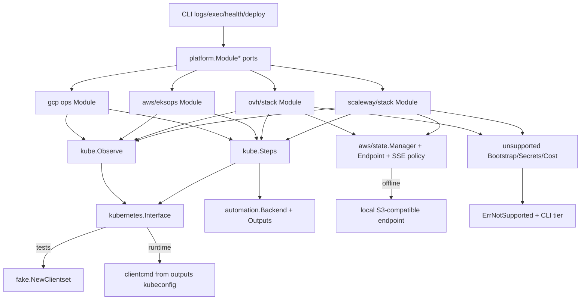

# Phase 6: Shared Kubernetes Day-2 - Research

**Researched:** 2026-07-30
**Domain:** Shared Kubernetes day-2 ports (`RuntimeObserve`, `deploy.Steps`) + S3-compatible OVH/Scaleway state
**Confidence:** HIGH (codebase seams verified); MEDIUM (SSE AES256 on third-party Object Storage; EKS exec-kubeconfig live path)

<user_constraints>
## User Constraints (from CONTEXT.md)

### Locked Decisions
### Shared Observe
- **D-01:** Ship concrete `kube.Observe` implementing `platform.RuntimeObserve`. All four Kubernetes modules’ `RuntimeObserve()` return that shared type (ctor OK). Client from stack kubeconfig/outputs; fake clientset inject for tests. Collapse GCP’s provider-local Observe into `kube`; do not expand `platform` with kube-specific methods; do not copy ECS Observe into each provider. — **Reversibility:** one-way — type-identity tests become the contract
- **D-02:** Thin per-provider Observe wrappers only as an escape hatch if a provider cannot emit usable kubeconfig — not the default. — **Reversibility:** reversible

### Shared deploy.Steps
- **D-03:** Single `kube.Steps` in `internal/cloud/kube` driving Validate → RegisterCandidate → RunMigrations → CleanupCandidate → UpdateServices → Stabilize → Health → Record. Each provider’s `NewDeploySteps` returns/wraps that type. Do not compose four provider Steps types; do not create `internal/deploy/kube`; do not merge ECS deployflow into kube. — **Reversibility:** one-way — KUBE-04 type-identity gate

### OVH / Scaleway state
- **D-04:** One shared S3-compatible state manager; OVH/SCW pass endpoint + creds (+ SSE policy generalization so AWS keeps KMS while others use compatible encryption). Prove offline against local S3-compatible endpoint. No forked state packages; no “Pulumi DIY only” cut for MageLift lock/backup. — **Reversibility:** costly — AcquireLock hard-fail flip depends on this seam

### Unsupported / honesty
- **D-05:** Where shared kube provides Observe/Steps (and State after D-04), delete stub methods and return the shared concrete types. Keep thin `unsupported{}` only for Bootstrap/Secrets/Cost (and any remaining cloud-shaped gaps) returning `platform.ErrNotSupported` with certification tier named by CLI — never `nil` success, never panic. Matrix-record working vs gap cells. — **Reversibility:** costly — TRUST-02 / capability-matrix honesty

### Phase spend / proof
- **D-06:** Phase 6 is zero cloud spend. Live GKE exercise is Phase 7 only. — **Reversibility:** N/A (spend map)

### Claude's Discretion
- Exact client factory / kubeconfig output key names (keep portable across four targets)
- Whether envtest is required vs fake clientset alone for Steps sequence
- SSE generalization API shape inside the existing AWS state package
- Matrix cell wording for remaining Bootstrap/Secrets gaps on experimental OVH/SCW

### Deferred Ideas (OUT OF SCOPE)
- Live GKE Autopilot logs/exec/deploy/health — Phase 7
- Full OVH/SCW Bootstrap/Secrets implementations — intentional gap until product prioritizes
- Merging ECS and kube deploy into one mega Steps — rejected
- **DNS / managed dump** — Phase 7 (MIGRATE-04 Cloudflare on `*.alexandrecourtiol.com` / `*.acourtiol.com`; managed dump cell rides GCP certification pass)
</user_constraints>

<phase_requirements>
## Phase Requirements

| ID | Description | Research Support |
|----|-------------|------------------|
| KUBE-01 | Shared `Observe.TailLogs` on all four K8s targets | Lift pod-log logic from `gcp/operations.ObserveStore.TailLogs` onto `kube.Observe` + `kubernetes.Interface`; type-identity gate |
| KUBE-02 | Shared `Observe.CheckRuntime` | Lift `deploymentHealth` from `gcp/operations/runtime.go` onto `kube.Observe` |
| KUBE-03 | Shared `Observe.PrepareExec` | Portable `kubectl` ExecTarget from outputs/`kubeconfig`; fix GKE-shaped `gke-job` launcher debt |
| KUBE-04 | Shared `deploy.Steps` in `internal/cloud/kube` | Collapse `gcp/deployment.Steps` + JobAPI migrate path into `kube.Steps`; four modules’ `NewDeploySteps` return same concrete type |
| KUBE-05 | OVH/SCW state via S3-compatible manager + endpoint | Generalize SSE in `aws/state`; wire OVH/SCW `State` through `NewAWSWithEndpoint`; Floci/local endpoint proof |
| KUBE-06 | Bootstrap/Secrets stay per-provider; loud tier failures | Keep thin `unsupported{}` for Bootstrap/Secrets/Cost; CLI `notSupportedMessage` already names tier |
| KUBE-07 | Replace OVH/SCW unsupported shells where shared layer provides | Delete Observe/Steps/State stubs; grep gate on remaining `ErrNotSupported`; matrix + experimental docs |
</phase_requirements>

## Summary

Phase 6 consolidates Magento day-2 for GKE Autopilot, EKS Autopilot, OVH MKS, and Scaleway Kapsule into `internal/cloud/kube`: one `Observe` and one `deploy.Steps`, plus OVH/SCW state reuse of the existing AWS S3 manager via endpoint override. Offline proof only (fake clientset + local S3-compatible endpoint). Live GKE, DNS cutover, and managed dump stay Phase 7. [VERIFIED: CONTEXT D-01..D-06; ROADMAP Phase 6 SC1–SC5]

The codebase already has most of the *logic* under GCP packages and most of the *shells* under EKS/OVH/SCW: `gcp/ops.Observe` and `gcp/deployment.Steps` call client-go today, but client construction is GKE-ADC-specific (`newGKEClientset` via Container API). OVH/Scaleway return a single `unsupported{}` with **15** `ErrNotSupported` sites each; EKS Observe + NewDeploySteps are stubs while Bootstrap/State/Secrets reuse AWS DIY packages. Stack `Outputs()` export `clusterName`/`serviceName` but **do not** export kubeconfig — a gap the shared Observe factory must close. [VERIFIED: codebase reads 2026-07-30]

**Primary recommendation:** Six plans — (1) SSE + OVH/SCW State, (2) kubeconfig output + client factory, (3) shared Observe + collapse GCP, (4) shared Steps + four `NewDeploySteps`, (5) unsupported honesty + AcquireLock flip + matrix/docs, (6) offline integration gates (type-identity + fake Steps sequence + Floci/local S3). Prefer `fake.NewClientset` only — do not add envtest. No new Go modules beyond what `go.mod` already pins.

**Recommended plan count:** 6

## Architectural Responsibility Map

| Capability | Primary Tier | Secondary Tier | Rationale |
|------------|-------------|----------------|-----------|
| Shared Observe (logs/health/exec) | API / Backend (`internal/cloud/kube`) | CLI (`internal/cli`) resolves port only | K8s-shaped; ADR 0008/0009 — CLI must not import kube |
| Shared Magento deploy Steps | API / Backend (`internal/cloud/kube`) | `internal/deploy` orchestrator sequences | Sequencing stays in deploy; Steps adapt to Jobs/Deployments |
| OVH/SCW DIY state lock/backup | API / Backend (`aws/state` + OVH/SCW ops) | Local S3 emulator (Floci) for proof | Cloud-shaped storage; one manager, endpoint override |
| Bootstrap / Secrets / Cost | Per-provider adapters | CLI tier-named errors | Stay unsupported on OVH/SCW until product prioritizes |
| Capability matrix honesty | CDN / Static (docs) | CLI refusal paths | TRUST-02 / KUBE-07 evidence rows |
| Live GKE / DNS / managed dump | — (Phase 7) | — | Explicitly deferred |

## Project Constraints (from .cursor/rules/)

| Directive | Implication for Phase 6 |
|-----------|-------------------------|
| Serial builds only on this 16 GB Mac | Never parallel `go build` / goreleaser / multi-platform matrices. Use `GOMAXPROCS=1 GOFLAGS=-p=1`. Packaging smoke only via `./scripts/release-smoke-local.sh` / `make release-smoke`. Full matrices on CI. |
| Abort under memory pressure | Do not retry heavy builds under Cursor; reap orphan `go tool compile` only when no intentional build is running. |
| AGENTS.md mirrors the same rule | Plans must not schedule concurrent agent builds or buildx multi-platform locally. |

## Standard Stack

### Core

| Library | Version | Purpose | Why Standard |
|---------|---------|---------|--------------|
| `k8s.io/client-go` | v0.33.2 | Clientset, fake, clientcmd | Already in `go.mod`; GCP operations already depend on it [VERIFIED: go.mod + `go list -m`] |
| `k8s.io/api` / `k8s.io/apimachinery` | v0.33.2 | Pods, Deployments, Jobs, metav1 | Paired with client-go [VERIFIED: go.mod] |
| `github.com/aws/aws-sdk-go-v2/service/s3` | v1.105.2 | DIY lock/backup PutObject | Existing state manager; endpoint override via `NewAWSWithEndpoint` [VERIFIED: go.mod + client.go] |
| `internal/deploy` `Steps` | in-tree | Magento candidate sequence contract | Do not invent a parallel interface [VERIFIED: orchestrator.go] |
| `internal/platform` ports | in-tree | `RuntimeObserve`, `Ops`, `State`, `ErrNotSupported` | ADR 0009 boundary [VERIFIED: observe.go, ops.go] |

### Supporting

| Library | Version | Purpose | When to Use |
|---------|---------|---------|-------------|
| `k8s.io/client-go/kubernetes/fake` | v0.33.2 | Offline Observe/Steps unit tests | Prefer `fake.NewClientset` (NewSimpleClientset deprecated) [VERIFIED: `go doc` v0.33.2] |
| `k8s.io/client-go/tools/clientcmd` | v0.33.2 | `RESTConfigFromKubeConfig` | Build live client from exported kubeconfig bytes [CITED: github.com/kubernetes/client-go/.../client_config.go] |
| Floci / LocalStack-compatible (`docker-compose.floci.yml`) | existing | Local S3 for KUBE-05 proof | `make floci-test` / `MAGELIFT_FLOCI=1` [VERIFIED: Makefile + tests/floci/state_test.go] |
| `internal/cloud/aws/endpoint` | in-tree | Loopback-only endpoint URL parse | Reuse; do not invent a second endpoint validator [VERIFIED: endpoint.go] |

### Alternatives Considered

| Instead of | Could Use | Tradeoff |
|------------|-----------|----------|
| `fake.NewClientset` | controller-runtime envtest | envtest downloads kube-apiserver/etcd via `setup-envtest`; CI/Makefile weight; not needed for Job/Deployment sequence with injected JobAPI [CITED: book.kubebuilder.io/reference/envtest] |
| Shared `aws/state` + SSE policy | Fork `ovh/state` / `scaleway/state` | Contradicts KUBE-05 / D-04 |
| `internal/deploy/kube` package | `internal/cloud/kube` | ADR 0002/0004 — deploy stays Magento-neutral; kube is cloud adapter [VERIFIED: ADR 0004, CONTEXT D-03] |
| Expand `platform` with kube methods | Keep kube types in `internal/cloud/kube` | D-01 forbids platform expansion |

**Installation:** none — no new modules. Use existing `go.mod` pins.

**Version verification:** `go list -m k8s.io/client-go` → `v0.33.2` (2026-07-30). AWS S3 SDK already required. Package-legitimacy seam is npm/pypi/crates-only; Go deps audited via `go.mod` + upstream Kubernetes org.

## Package Legitimacy Audit

> No new external packages. Existing Kubernetes and AWS SDK modules remain.

| Package | Registry | Age | Downloads | Source Repo | Verdict | Disposition |
|---------|----------|-----|-----------|-------------|---------|-------------|
| `k8s.io/client-go` | Go module (already pinned) | mature | N/A | kubernetes/client-go | OK (in-tree pin) | Approved — no install |
| `k8s.io/api` | Go module (already pinned) | mature | N/A | kubernetes/api | OK | Approved — no install |
| `github.com/aws/aws-sdk-go-v2/service/s3` | Go module (already pinned) | mature | N/A | aws/aws-sdk-go-v2 | OK | Approved — no install |

**Packages removed due to [SLOP] verdict:** none  
**Packages flagged as suspicious [SUS]:** none  
**Note:** `gsd-tools query package-legitimacy` only supports npm/pypi/crates — Go modules verified via `go.mod` / `go list -m` instead.

## Architecture Patterns

### System Architecture Diagram



### Recommended Project Structure

```
internal/cloud/kube/
├── kube.go              # existing helpers (SkipAwait, EnvVars, BuildStaticTokenKubeconfig)
├── client.go            # NEW: ClientFromKubeconfig / optional ClientFactory inject
├── observe.go           # NEW: kube.Observe (TailLogs, CheckRuntime, PrepareExec)
├── observe_test.go
├── steps.go             # NEW: kube.Steps (deployflow.Steps) — lift from gcp/deployment
├── steps_test.go        # fake clientset / fake JobAPI sequence
├── candidate.go         # NEW: Job-based migrate candidate (lift gcp/operations jobs)
└── identity_test.go     # optional shared helpers for type-identity assertions

internal/cloud/aws/state/
├── lock.go              # generalize SSE / stop requiring KMS ARN for AES256 path
├── archive.go           # same SSE policy
├── client.go            # NewAWSWithEndpoint already exists
└── encryption.go        # NEW: EncryptionPolicy {KMS | AES256 | none-for-tests}

internal/cloud/gcp/ops/
├── day2.go              # RuntimeObserve() → kube.NewObserve(...); delete local Observe body
└── module.go            # NewDeploySteps → kube.New(...)

internal/cloud/{aws/eksops,ovh/stack,scaleway/stack}/
└── ops.go               # wire shared Observe/Steps/State; thin unsupported for gaps
```

### Pattern 1: Injectable kubernetes.Interface
**What:** `kube.Observe` and candidate runners accept `kubernetes.Interface` (or a `ClientFactory` that returns one from outputs).  
**When to use:** Always — enables fake clientset offline and kubeconfig-based live clients.  
**Example:**
```go
// Source: k8s.io/client-go/tools/clientcmd (RESTConfigFromKubeConfig)
cfg, err := clientcmd.RESTConfigFromKubeConfig([]byte(kubeconfigYAML))
if err != nil { return nil, err }
return kubernetes.NewForConfig(cfg)
```

### Pattern 2: Type-identity gate
**What:** Test that all four modules’ `RuntimeObserve()` / `NewDeploySteps` return `*kube.Observe` / `*kube.Steps` (or the same named concrete type).  
**When to use:** ROADMAP SC1–SC2 / KUBE-01..04 acceptance.  
**Example:**
```go
obs := platform.ModuleRuntimeObserve(mod)
if _, ok := obs.(*kube.Observe); !ok {
    t.Fatalf("want *kube.Observe, got %T", obs)
}
```

### Pattern 3: SSE policy on existing Manager
**What:** Replace hard-coded `ServerSideEncryptionAwsKms` + `kmsKeyARN` regex gate with a small policy: AWS production keeps KMS; OVH/SCW/Floci-compatible path uses `ServerSideEncryptionAes256` (or omit when emulator requires).  
**When to use:** KUBE-05.  
**Example:**
```go
// Source: AWS S3 SSE-S3 docs — AES256 without KMS
input.ServerSideEncryption = s3types.ServerSideEncryptionAes256
```

### Anti-Patterns to Avoid
- **Copying ECS Observe/Steps into each K8s provider:** Rejected (D-01/D-03).
- **Putting kube types in `internal/deploy` or `internal/platform`:** Violates ADR 0002/0004/0008 and D-01/D-03.
- **Leaving GCP `ops.Observe` as a parallel implementation:** Must collapse into kube (D-01).
- **envtest by default:** Binary download + Makefile surface for little gain vs fake + JobAPI inject.
- **Exporting kubeconfig without secret marking:** Pulumi already uses `pulumi.ToSecret` on component fields — stack Export must preserve secret.
- **Parallel local builds:** Forbidden on this machine.

## Don't Hand-Roll

| Problem | Don't Build | Use Instead | Why |
|---------|-------------|-------------|-----|
| Fake Kubernetes API | Custom mock structs per method | `kubernetes/fake.NewClientset` | Tracks objects; reactors for errors [VERIFIED: go doc] |
| Kubeconfig → REST | Manual YAML parse | `clientcmd.RESTConfigFromKubeConfig` | Official helper [CITED: client-go client_config.go] |
| S3 DIY lock | New OVH/SCW lock packages | `aws/state` + `NewAWSWithEndpoint` | KUBE-05 / D-04 |
| Endpoint URL safety | Ad-hoc parse | `aws/endpoint.Parse` | Loopback-only anti-exfil [VERIFIED: endpoint.go] |
| Tier-named unsupported errors | Custom error strings per provider | `platform.ErrNotSupported` + CLI `notSupportedMessage` | TRUST-02 already wired [VERIFIED: ports.go] |
| Magento deploy sequencing | New orchestrator | `internal/deploy.Orchestrator` + `Steps` | Sequence already correct |

**Key insight:** Phase 6 is mostly *relocation and wiring*, not greenfield algorithms. GCP already proved pod logs, Deployment health, and migrate Jobs on client-go — the missing piece is provider-neutral client construction + four-module registration.

## Runtime State Inventory

> Refactor/migration of Observe/Steps/State wiring — runtime state checked.

| Category | Items Found | Action Required |
|----------|-------------|------------------|
| Stored data | DIY lock objects under `locks/{project}/{env}.json` in S3/GCS; Floci test buckets | Code: SSE policy change must remain compatible with existing AWS KMS-encrypted locks. No rename of lock key paths. |
| Live service config | None for Phase 6 (offline) — no live GKE/EKS/OVH/SCW mutation | None in Phase 6 |
| OS-registered state | None — verified no launchd/systemd Magento day-2 agents | None |
| Secrets/env vars | `MAGELIFT_AWS_ENDPOINT_URL`, `MAGELIFT_FLOCI`, `MAGELIFT_FLOCI_ENDPOINT`; AWS/OVH/SCW creds for real accounts (unused offline) | Code may add OVH/SCW object-storage endpoint + access key config fields; do not rename Floci env vars |
| Build artifacts | Existing binaries under `dist/` from release-smoke; no kube Observe package yet | Serial rebuild only if packaging touched (should not be) |

**Nothing found** beyond DIY lock object format and Floci env — lock key path and JSON `Info` schema must stay stable when generalizing SSE.

## Common Pitfalls

### Pitfall 1: Assuming stack outputs already include kubeconfig
**What goes wrong:** Shared Observe cannot build a client; falls back to GKE ADC or thin wrappers by default.  
**Why it happens:** Runtime components hold `Kubeconfig` fields, but `stack.Component.Outputs()` only exports `RequiredOutputKeys` (+ media extras on GCP) — **no kubeconfig export today**. [VERIFIED: gcp/stack/component.go Outputs; ovh/eksops Outputs]  
**How to avoid:** Add portable optional output key (recommend `kubeconfig`) to all four K8s stack Outputs; keep it out of `RequiredOutputKeys` until all modules export it, or add only on K8s modules’ `OutputKeys()`.  
**Warning signs:** Observe still calling `newGKEClientset` after “collapse.”

### Pitfall 2: EKS exec-plugin kubeconfig vs static-token path
**What goes wrong:** Shared clientcmd path fails without `aws` CLI / breaks “no exec plugin” lesson.  
**Why it happens:** `aws/eks/runtime.generateKubeconfig` emits `user.exec` with `aws eks get-token`. [VERIFIED: eks/runtime.go] OVH/SCW/GKE Pulumi paths use `kube.BuildStaticTokenKubeconfig`.  
**How to avoid:** For Phase 6 offline, inject fake clientset. For EKS export, prefer static token or IAM authenticator in-process later; D-02 escape hatch only if EKS cannot emit usable kubeconfig. Do not block Phase 6 on live EKS auth.  
**Warning signs:** PrepareExec/TailLogs tests requiring network to AWS STS.

### Pitfall 3: Hard KMS ARN validation blocks OVH/SCW
**What goes wrong:** `NewManager` rejects empty/non-ARN encryption keys.  
**Why it happens:** `kmsKeyARN` regex is mandatory in `NewManager` / `NewArchiveFromClient`. [VERIFIED: lock.go:55-57, archive.go:69-70]  
**How to avoid:** EncryptionPolicy: KMS requires ARN; AES256 does not. Keep AWS callers on KMS policy.  
**Warning signs:** Unit tests still passing fake `arn:aws:kms:...` into OVH paths.

### Pitfall 4: Counting unsupported sites after partial wiring
**What goes wrong:** ROADMAP SC4 grep gate fails or over-deletes Bootstrap/Secrets.  
**Why it happens:** Today 15 sites each (14 unsupported methods + `NewDeploySteps`). After D-05 expect ~6 left: VerifyAccount, Ensure, List, Set, Remove, Estimate (+ maybe AcquireLock until flipped). [VERIFIED: ovh/scaleway ops.go; Phase 1 research count]  
**How to avoid:** Explicit allowlist test of remaining methods; assert Observe/State/NewDeploySteps are *not* ErrNotSupported.  
**Warning signs:** `unsupported{}` still embedding TailLogs after wiring.

### Pitfall 5: CLI exec launcher quirk
**What goes wrong:** GKE PrepareExec returns `Launcher: "gke-job"` and args without `kubectl`; CLI `runExecTarget` passes empty binary name and uses Args only. [VERIFIED: day2.go PrepareExec; cli/exec.go:104-116]  
**How to avoid:** Shared PrepareExec returns `Launcher: "kubectl"` and Args as the argv *after* the binary (matching AWS pattern), or fix CLI to `runCommand(ctx, launcher, args)` in the same phase if tests prove broken.  
**Warning signs:** exec unit tests only cover AWS fake Observe.

### Pitfall 6: Parallel builds / envtest binary downloads on this Mac
**What goes wrong:** Kernel panic / swap thrash; CI flake from missing envtest assets.  
**How to avoid:** Serial `go test`; fake clientset only; Floci via existing compose script.  
**Warning signs:** Plan tasks mentioning `setup-envtest` or `goreleaser --parallelism>1`.

## Code Examples

### Build clientset from kubeconfig bytes
```go
// Source: https://github.com/kubernetes/client-go/blob/master/tools/clientcmd/client_config.go
cfg, err := clientcmd.RESTConfigFromKubeConfig([]byte(kubeconfigYAML))
if err != nil {
    return nil, err
}
return kubernetes.NewForConfig(cfg)
```

### Fake clientset for Observe tests
```go
// Source: k8s.io/client-go/kubernetes/fake (v0.33.2 go doc)
cs := fake.NewClientset(
    &appsv1.Deployment{ /* ready replicas */ },
    &corev1.Pod{ /* labels app=... */ },
)
obs := kube.NewObserve(cs /* namespace default */)
```

### Existing pod-log pattern to lift
```go
// Source: internal/cloud/gcp/operations/runtime.go TailLogs (verified in-repo)
pods, err := clientset.CoreV1().Pods("default").List(ctx, metav1.ListOptions{
    LabelSelector: "app=" + deployment,
})
req := clientset.CoreV1().Pods("default").GetLogs(pod.Name, opts)
```

### SSE-S3 without KMS
```go
// Source: https://docs.aws.amazon.com/AmazonS3/latest/userguide/specifying-s3-encryption.html
PutObjectInput{
    ServerSideEncryption: s3types.ServerSideEncryptionAes256,
}
```

### Tier-named unsupported (keep for Bootstrap/Secrets)
```go
// Source: internal/cli/ports.go
// "{surface} is not supported for target {provider}/{runtime} yet ({tier})"
return notSupported(platform.ErrNotSupported, planned, "secrets")
```

## State of the Art

| Old Approach | Current Approach | When Changed | Impact |
|--------------|------------------|--------------|--------|
| GCP-local Observe + GKE ADC client | Shared `kube.Observe` + kubeconfig/fake | Phase 6 | Three more targets inherit day-2 |
| GCP-local `deployment.Steps` | Shared `kube.Steps` | Phase 6 | KUBE-04 type-identity |
| OVH/SCW full unsupported shell | Shared Observe/Steps/State; stub Bootstrap/Secrets/Cost | Phase 6 | Honesty matrix update |
| AWS state KMS-only PutObject | EncryptionPolicy KMS \| AES256 | Phase 6 | Enables S3-compatible DIY |
| `fake.NewSimpleClientset` | `fake.NewClientset` | client-go ≥ field-management era | Prefer NewClientset (Simple deprecated) [VERIFIED: go doc] |

**Deprecated/outdated:**
- Provider-local GCP Observe body in `gcp/ops/day2.go` after collapse
- OVH/SCW docs claiming “every day-2 port returns ErrNotSupported” once Observe/Steps/State land
- EKS docs claiming Observe always unsupported once wired

## Assumptions Log

| # | Claim | Section | Risk if Wrong |
|---|-------|---------|---------------|
| A1 | OVH Object Storage / Scaleway Object Storage accept AWS SDK PutObject with `AES256` (or no SSE header) via path-style endpoint | KUBE-05 / SSE | Offline Floci proves the *code path*; real OVH/SCW may need “omit SSE” policy — keep a third policy variant ready |
| A2 | Exporting `kubeconfig` as a Pulumi stack output (secret) is acceptable for Magento day-2 without adding it to `RequiredOutputKeys` for ECS | Client factory | If secret export is rejected, need file-based kubeconfig from DIY backend instead |
| A3 | Fake clientset Job create/watch is sufficient to drive Steps sequence without envtest | Steps testing | If Job status never becomes Complete under fake, inject JobAPI interface (already exists in gcp/operations) rather than envtest |
| A4 | CLI `runExecTarget` empty-binary behavior is intentional for AWS Args shape and should be preserved for kubectl | PrepareExec | May need a one-line CLI fix in the Observe plan |

**If wrong:** Planner should treat A1/A3 as implementation toggles inside discretion, not phase blockers.

## Open Questions

> Discretion items from CONTEXT — **RESOLVED** for planning.

1. **Client factory / kubeconfig output key names — RESOLVED**
   - What we know: No stack output exports kubeconfig today; components already generate it.
   - Recommendation: Add constant `platform.OutputKubeconfig = "kubeconfig"` (optional, not in `RequiredOutputKeys`). All four K8s `Outputs()` export it as secret. Factory: `kube.ClientFromOutputs(outputs)` via `RequireStringOutput(..., OutputKubeconfig)` + `RESTConfigFromKubeConfig`. Tests inject `kubernetes.Interface` directly.
   - EKS: if exec kubeconfig cannot build offline, D-02 escape hatch returns ErrNotSupported *only* when factory fails — not the default registration.

2. **envtest vs fake clientset — RESOLVED**
   - Recommendation: **fake.NewClientset only** (+ inject `JobAPI` for migrate Jobs, matching existing `NewDeploymentFromClient`). Do not add controller-runtime/envtest in Phase 6.

3. **SSE generalization API shape — RESOLVED**
   - Recommendation: In `internal/cloud/aws/state`, introduce `type ObjectEncryption struct { Mode EncryptionMode; KMSKeyARN string }` with `EncryptionKMS` (require ARN, set AwsKms) and `EncryptionAES256` (no ARN, set Aes256). `NewManager` / archive constructors take `ObjectEncryption`. AWS callers pass KMS; OVH/SCW + Floci AES256 tests pass AES256. Optional `EncryptionNone` only if Floci rejects SSE headers (prove in Wave for KUBE-05).

4. **Matrix cell wording for OVH/SCW Bootstrap/Secrets — RESOLVED**
   - Recommendation: Day-2 column → `Observe+Steps+State offline (unit/Floci); Bootstrap/Secrets/Cost unsupported (experimental)`. Magento deploy Ops → `shared kube.Steps (offline fake); live unpaid`. Keep tier `experimental`. Update `docs/ovh-experimental.md` / `docs/scaleway-experimental.md` Deferred bullets accordingly.

5. **DNS / managed dump — RESOLVED (out of scope)**
   - Phase 7 only. Operator authorized Cloudflare subdomains — do not implement here.

## Recommended Plan Waves (~6)

| Wave | Plan | Delivers | Requirements |
|------|------|----------|--------------|
| 1 | `06-01` SSE policy + OVH/SCW `State` via `NewAWSWithEndpoint` + Floci/local proof | KUBE-05 foundation; enables AcquireLock flip | KUBE-05 |
| 2 | `06-02` `OutputKubeconfig` + `kube` client factory + export from four stack Outputs | Unblocks Observe/Steps without GKE ADC | Discretion / D-01 |
| 3 | `06-03` `kube.Observe` + collapse GCP Observe + wire four `RuntimeObserve()` + type-identity tests | KUBE-01..03, SC1 | KUBE-01,02,03 |
| 4 | `06-04` `kube.Steps` (lift gcp/deployment + jobs) + four `NewDeploySteps` + fake sequence test | KUBE-04, SC2 | KUBE-04 |
| 5 | `06-05` unsupported shell surgery, AcquireLock→real State lock on OVH/SCW/EKS as applicable, matrix + experimental docs, nil-success guards | KUBE-06,07, SC4–SC5 | KUBE-06,07 |
| 6 | `06-06` Offline integration gates: cross-module type-identity package, Steps through all four registrations, Floci state gate script row, docs release-readiness touch | SC1–SC5 glue | all |

**Plan count: 6** (fits 5–7). Do not add a seventh for envtest or live GCP.

## Environment Availability

| Dependency | Required By | Available | Version | Fallback |
|------------|------------|-----------|---------|----------|
| Go toolchain | all packages | ✓ | go1.26.5 | — |
| Docker | Floci S3 endpoint | ✓ | 29.6.2 | Skip Floci with clear skip; unit-test SSE with mocked S3API |
| `make floci-test` / compose | KUBE-05 proof | ✓ | scripts/floci-test.sh | Mock `S3API` unit tests still required |
| `k8s.io/client-go` | Observe/Steps | ✓ | v0.33.2 | — |
| Live GCP/AWS/OVH/SCW | — | N/A | — | **Forbidden** (D-06) |
| envtest binaries | — | ✗ / unused | — | Use fake clientset |
| Parallel goreleaser | — | Forbidden | — | Serial smoke only if packaging touched |

**Missing dependencies with no fallback:** none for offline Phase 6  
**Missing dependencies with fallback:** live clouds (deferred Phase 7)

## Validation Architecture

> `workflow.nyquist_validation: true` in `.planning/config.json`

### Test Framework

| Property | Value |
|----------|-------|
| Framework | Go `testing` + race (`make test`) |
| Config file | none (Makefile `test` target); Floci build tag `floci` |
| Quick run command | `GOMAXPROCS=1 GOFLAGS=-p=1 go test ./internal/cloud/kube/... ./internal/cloud/aws/state/... -count=1` |
| Full suite command | `GOMAXPROCS=1 GOFLAGS=-p=1 go test ./internal/cloud/kube/... ./internal/cloud/gcp/ops/... ./internal/cloud/aws/eksops/... ./internal/cloud/ovh/... ./internal/cloud/scaleway/... -count=1` then `make floci-test` for KUBE-05 |

### Phase Requirements → Test Map

| Req ID | Behavior | Test Type | Automated Command | File Exists? |
|--------|----------|-----------|-------------------|-------------|
| KUBE-01 | TailLogs via shared Observe | unit (fake pods) | `go test ./internal/cloud/kube -run TestObserveTailLogs -count=1` | ❌ Wave 0 |
| KUBE-02 | CheckRuntime via shared Observe | unit (fake Deployment) | `go test ./internal/cloud/kube -run TestObserveCheckRuntime -count=1` | ❌ Wave 0 |
| KUBE-03 | PrepareExec portable kubectl target | unit | `go test ./internal/cloud/kube -run TestObservePrepareExec -count=1` | ❌ Wave 0 |
| KUBE-04 | Steps full sequence on fake | unit | `go test ./internal/cloud/kube -run TestStepsSequence -count=1` | ❌ Wave 0 |
| KUBE-01..04 | Four modules return `*kube.Observe` / `*kube.Steps` | unit | `go test ./internal/cloud/kube -run TestTypeIdentity -count=1` | ❌ Wave 0 |
| KUBE-05 | Lock/backup/restore AES256 + endpoint | unit + Floci | `go test ./internal/cloud/aws/state -run TestEncryptionAES256 -count=1`; `make floci-test` | ⚠️ Floci KMS path exists; AES256 path ❌ |
| KUBE-06 | Bootstrap/Secrets never nil-success | unit | `go test ./internal/cloud/ovh/stack ./internal/cloud/scaleway/stack -run TestUnsupported -count=1` | ✅ partial (extend) |
| KUBE-07 | Grep/allowlist remaining ErrNotSupported | unit | `go test ./internal/cloud/ovh/stack -run TestRemainingUnsupportedAllowlist -count=1` | ❌ Wave 0 |
| SC5 | Matrix docs mention day-2 surface | docs gate / string test optional | manual + link check in plan verify | ❌ |

### Sampling Rate
- **Per task commit:** quick `go test` on touched packages (serial, `GOMAXPROCS=1`)
- **Per wave merge:** full suite command above
- **Phase gate:** Full suite green + `make floci-test` for KUBE-05 before `/gsd-verify-work`

### Wave 0 Gaps
- [ ] `internal/cloud/kube/observe_test.go` — KUBE-01..03
- [ ] `internal/cloud/kube/steps_test.go` — KUBE-04 sequence
- [ ] `internal/cloud/kube/identity_test.go` (or per-module tests) — type-identity
- [ ] `internal/cloud/aws/state` AES256 / EncryptionPolicy tests — KUBE-05
- [ ] OVH/SCW remaining-unsupported allowlist tests — KUBE-07
- [ ] Extend Floci or add local endpoint test proving AES256 lock path (may reuse Floci with EncryptionAES256 if KMS-less PutObject works)

## Security Domain

### Applicable ASVS Categories

| ASVS Category | Applies | Standard Control |
|---------------|---------|-----------------|
| V2 Authentication | yes (kube API / S3) | kubeconfig token or cloud IAM; DIY S3 creds from env — no long-lived keys in repo |
| V3 Session Management | no | — |
| V4 Access Control | yes | Namespace default + label selectors; DIY lock IfNoneMatch concurrency |
| V5 Input Validation | yes | Existing stable-name / bucket regex; validate kubeconfig parse errors; exec command NUL/newline checks in CLI |
| V6 Cryptography | yes | SSE-KMS (AWS) or SSE-S3 AES256 (compatible); never hand-roll crypto |

### Known Threat Patterns for Magento kube day-2 + S3 state

| Pattern | STRIDE | Standard Mitigation |
|---------|--------|---------------------|
| Kubeconfig secret leakage in logs | Information disclosure | Pulumi secret outputs; never print kubeconfig in diagnostics |
| Endpoint override exfiltration | Spoofing | `aws/endpoint.Parse` loopback-only for emulator env |
| DIY lock overwrite | Tampering | S3 `IfNoneMatch: *` acquire; unchanged |
| Exec command injection | Elevation | CLI rejects NUL/newlines; fixed argv slice |
| Claiming certified day-2 without evidence | Repudiation | Matrix tier + offline evidence labels; D-06 no live spend |
| Nil-success unsupported ports | Elevation of privilege (false confidence) | ErrNotSupported + tier; nil-success tests |

## Sources

### Primary (HIGH confidence)
- In-repo: `internal/cloud/kube/kube.go`, `gcp/ops/day2.go`, `gcp/deployment/steps.go`, `gcp/operations/{runtime,k8s,candidate}.go`, `aws/state/{client,lock,archive}.go`, `aws/endpoint`, `ovh/stack/ops.go`, `scaleway/stack/ops.go`, `eksops/ops.go`, `platform/observe.go`, `platform/outputs.go`, `cli/ports.go`, `cli/exec.go`, ADRs 0002/0004/0008/0009
- `go list -m k8s.io/client-go` → v0.33.2; `go doc` fake.NewClientset / NewSimpleClientset
- CONTEXT.md D-01..D-06; ROADMAP Phase 6; REQUIREMENTS KUBE-01..07

### Secondary (MEDIUM confidence)
- client-go `RESTConfigFromKubeConfig` — [CITED: github.com/kubernetes/client-go/.../client_config.go]
- Amazon S3 SSE-S3 AES256 — [CITED: docs.aws.amazon.com/AmazonS3/latest/userguide/specifying-s3-encryption.html]
- envtest binary requirements — [CITED: book.kubebuilder.io/reference/envtest]

### Tertiary (LOW confidence)
- Exact OVH/Scaleway Object Storage SSE header compatibility with AWS SDK — [ASSUMED] A1; prove offline then adjust policy

## Metadata

**Confidence breakdown:**
- Standard stack: HIGH — pinned in go.mod, already used by GCP operations
- Architecture: HIGH — ADRs + existing GCP lift path verified
- Pitfalls: HIGH — kubeconfig export gap and KMS gate verified in code; EKS exec kubeconfig MEDIUM for live

**Research date:** 2026-07-30  
**Valid until:** 2026-08-30 (stable Go/k8s pins; re-check if client-go major bumps)

**Recommended plan count:** 6
