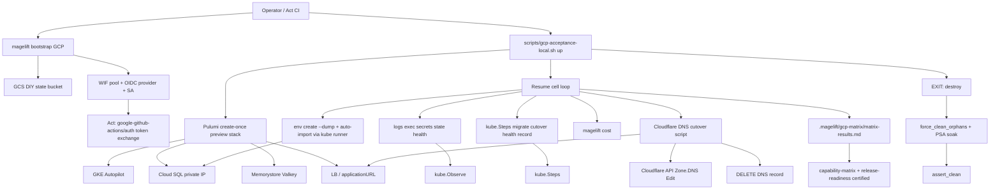

# Phase 7: GCP Certification - Research

**Researched:** 2026-07-30
**Domain:** GKE Autopilot live certification, WIF bootstrap, Secret Manager Composer creds, acceptance harness cells, managed dump-import, Cloudflare DNS cutover, force_clean/PSA
**Confidence:** HIGH (codebase + docs + official Cloudflare/GCP auth sources); MEDIUM on live Catalog API cost path and exact managed-dump runner shape

<user_constraints>
## User Constraints (from CONTEXT.md)

### Locked Decisions
- **D-01:** Use existing GCP project `digital-lab-341608` (active gcloud config). Prefer a low-cost region already used by MageLift GCP docs (confirm in RESEARCH; default `europe-west1` if docs agree). Prefix resources with harness prefix (`mlgcpwt` or docs default). — **Reversibility:** reversible project choice before first create
- **D-02:** Single create-once harness pass (Phase 3 pattern): resume-friendly cells for day-2 commands + deploy + dump-import + cost; evidence in `.magelift/gcp-matrix/matrix-results.md`; teardown with force_clean + PSA soak. No exploratory second create. — **Reversibility:** one-way once spend starts
- **D-03:** One harness cell: synthetic sanitized SQL fixture → `env create --dump` → after first successful deploy, assert tables in Cloud SQL + journal `imported`. Uses Phase 5 dumpimport/auto-import. — **Reversibility:** reversible fixture content
- **D-04:** Preview host `magelift-preview.alexandrecourtiol.com` (fallback `magelift-preview.acourtiol.com`). Create/update CNAME or A via Cloudflare API using `CLOUDFLARE_API_TOKEN` / `CF_API_TOKEN` with Zone.DNS Edit — **not** Wrangler OAuth (zone:read only). Point at stack ingress/LB from the paid pass. Record cutover rehearsal; delete DNS record on cleanup. — **Reversibility:** reversible DNS records
- **D-05:** Bootstrap WIF on the real project. Prove token exchange without committing SA keys. Hosted GitHub Actions minutes exhausted → prove with Act locally and/or a documented `gcloud` WIF exchange; matrix records Act-only until minutes return. — **Reversibility:** costly once WIF pools exist (must cleanup)
- **D-06:** Mark `gcp` / `gke-autopilot` certified only after evidence rows exist for SC1–SC5; update capability-matrix + release-readiness citing this pass. — **Reversibility:** costly — certification claim

### Claude's Discretion
- Exact cell order in harness resume file
- Whether dump cell runs before or after day-2 cells (prefer after create-once healthy)
- Cloudflare record type (CNAME vs A) based on what the stack exports

### Deferred Ideas (OUT OF SCOPE)
- Phase 8 brownfield attach
- Multi-region GCP
- Hosted GitHub Actions green (minutes)
</user_constraints>

<phase_requirements>
## Phase Requirements

| ID | Description | Research Support |
|----|-------------|------------------|
| GCP-01 | Bootstrap WIF; CI auth without long-lived SA keys | Extend `internal/cloud/gcp/bootstrap` beyond GCS DIY; mirror AWS OIDC pattern; Act/`gcloud` WIF exchange until GH minutes return |
| GCP-02 | Composer creds via Secret Manager; no nil-success secrets paths | Wire `gcp-secret-manager://` in `loadComposerCredentials`; SM List/Set/Remove already exist; add AccessSecretVersion + loud-failure tests |
| GCP-03 | Day-2 logs/exec/secrets/state/health on live GKE | Shared `kube.Observe` from Phase 6; harness day-2 cells + pullable digest |
| GCP-04 | Deploy migrate→cutover→health→record on GKE Autopilot | Shared `kube.Steps` / `NewDeploySteps`; live Magento deploy cell |
| GCP-05 | `magelift cost` per-cell estimate for GCP | Replace `unsupportedCost` with AWS-shaped CostEstimator (account-free + optional Catalog live) |
| GCP-06 | Record certified tier + release-readiness | Evidence rows SC1–SC5 → capability-matrix + release-readiness |
| MIGRATE-04 (P7 half) | DNS cutover rehearsal + managed dump cell | Cloudflare API script + Cloud SQL private-IP dump runner via cluster adjacency |
</phase_requirements>

## Summary

Phase 7 is the **second paid pass** (ROADMAP Cloud Spend Map): one create-once GKE Autopilot stack on `digital-lab-341608` / `europe-west1` / prefix `mlgcpwt`, resume-friendly harness cells, then destroy → `force_clean_orphans` (PSA soak) → `assert_clean`. Offline work must close WIF bootstrap, Composer Secret Manager resolution, CostEstimator, harness cell catalog, Cloudflare DNS script, and a managed dump connectivity path **before** `up`. [VERIFIED: docs/gcp-acceptance.md, ROADMAP Phase 7, 07-CONTEXT.md]

Code reality today: bootstrap creates GCS DIY state only (`wif: "deferred"`); Composer `gcp-secret-manager://` returns an explicit not-implemented error (loud — good); Secret Manager List/Set/Remove work; CostEstimator returns `ErrNotSupported`; Cloud SQL is **private IP only** (`Ipv4Enabled: false`); dumpimport defaults to `127.0.0.1`/compose — **will not reach Cloud SQL from the Mac without a VPC-adjacent runner**. [VERIFIED: internal/cloud/gcp/ops/day2.go, internal/cli/build.go, internal/cloud/gcp/database/database.go, internal/dumpimport/import.go]

Historical matrix (2026-07-21, prefix `mlgcpmx`) already proved ~19m21s infra create + force_clean lessons; Magento health/logs failed on placeholder digest — Phase 7 needs a **pullable** image. [VERIFIED: .magelift/gcp-matrix/matrix-results.md, docs/gcp-experimental.md]

**Primary recommendation:** Seven plans — offline WIF+secrets, CostEstimator, harness cells, managed dump runner, Cloudflare DNS script, single live pass+force_clean, then certification docs. Gate live create on refreshed ADC + Zone.DNS Edit token (execute prerequisites, not product questions).

**Recommended plan count:** **7**

## Architectural Responsibility Map

| Capability | Primary Tier | Secondary Tier | Rationale |
|------------|-------------|----------------|-----------|
| WIF pool/provider/SA binding | API / Backend (gcp bootstrap) | CI (Act workflow) | Cloud-shaped Bootstrap port; CI only consumes federation |
| Composer Secret Manager read/write | API / Backend (secrets + CLI build) | — | platform.Secrets + secretref; never browser |
| Day-2 Observe (logs/exec/health) | API / Backend (`kube.Observe`) | GKE API | Shared K8s tier; live exercise in harness |
| Deploy Steps sequence | API / Backend (`kube.Steps`) | GKE Jobs | Shared deployflow; Magento ops on cluster |
| Cost estimate | API / Backend (gcp CostEstimator) | Billing Catalog API | Account-free first; live Catalog optional |
| Managed dump import | API / Backend (dumpimport runner) | GKE pod / Auth Proxy | Private IP → must run VPC-adjacent |
| Cloudflare DNS cutover | Ops script / harness | Cloudflare API | Not Wrangler; token Zone.DNS Edit |
| Evidence + certification | Harness + docs | — | matrix-results.md then capability-matrix / release-readiness |
| force_clean / PSA soak | Acceptance script | Compute / Service Networking | Already in gcp-acceptance-local.sh |

## Project Constraints (from .cursor/rules/)

| Directive | Implication for Phase 7 |
|-----------|-------------------------|
| Serial builds only (`GOMAXPROCS=1`, `GOFLAGS=-p=1`) | All `go test` / builds serial; never parallel agent builds during live pass |
| Prefer `./scripts/release-smoke-local.sh` / `make release-smoke` | Do not run full goreleaser matrices locally for certification |
| Abort under memory pressure; reap orphan compile procs | Live Pulumi Up is long (~20m) — run outside Cursor if machine crawls; do not parallel with other builds |
| AGENTS.md same constraint | Document in live-pass plan: one build/test at a time |

## Standard Stack

### Core

| Library / Tool | Version | Purpose | Why Standard |
|----------------|---------|---------|--------------|
| Go | 1.26.5 (local) | CLI + adapters | Project language [VERIFIED: `go version`] |
| `cloud.google.com/go/secretmanager` | v1.20.0 | SM List/Set/Access | Already in go.mod [VERIFIED: go.mod] |
| `cloud.google.com/go/storage` | v1.63.1 | GCS DIY state bootstrap | Already used by bootstrap [VERIFIED: go.mod] |
| Pulumi + Automation API | (project) | Stack create/destroy | Existing GCP stack |
| `gcloud` CLI | 576.0.0 | ADC, WIF exchange, force_clean | Operator tool [VERIFIED: `gcloud --version`] |
| Act | 0.2.89 | Local GitHub Actions for WIF proof | D-05 Act-only until minutes [VERIFIED: `act --version`] |
| Cloudflare API v4 | HTTP | DNS create/update/delete | Official DNS Write path [CITED: developers.cloudflare.com/api] |
| `google-github-actions/auth` | @v3 | Workflow WIF exchange | Official keyless auth [CITED: github.com/google-github-actions/auth] |

### Supporting

| Library / Tool | Version | Purpose | When to Use |
|----------------|---------|---------|-------------|
| Cloud SQL Auth Proxy | latest binary | Optional dump path | Only if not using kubectl-exec into Magento pod [CITED: cloud.google.com/sql/docs/mysql/sql-proxy] |
| Cloud Billing Catalog API | v1 | Live SKU prices | Optional `--live` cost mode [CITED: docs.cloud.google.com/billing/v1/how-tos/catalog-api] |
| `testdata/fixtures/migrate/tiny.sql` | fixture | Synthetic dump | D-03 managed dump cell [VERIFIED: repo] |
| `scripts/acceptance/lib-checkpoint.sh` + `lib-evidence.sh` | existing | Resume + evidence rows | Extend GCP live cell loop like AWS |

### Alternatives Considered

| Instead of | Could Use | Tradeoff |
|------------|-----------|----------|
| kubectl-exec dump import | Cloud SQL Auth Proxy + IAP VM | Proxy+IAP heavier; pods already on VPC |
| Account-free cost table | Always-live Catalog API | Live needs API enablement; account-free matches AWS honesty |
| Cloudflare Go SDK | curl/`scripts/` shell | Script matches handoff; no new Go dep |
| Hosted GH Actions WIF job | Act + documented `gcloud` STS | Minutes exhausted — D-05 |

**Installation:** No new npm/PyPI packages. Prefer existing Go modules + shell for Cloudflare. If adding `google.golang.org/api/cloudbilling`, verify with `go get` only after plan approval — not required for account-free CostEstimator.

**Version verification:** secretmanager v1.20.0, storage v1.63.1 confirmed in go.mod (2026-07-30).

## Package Legitimacy Audit

> No new registry packages are required for the recommended path (extend existing modules + curl Cloudflare API).

| Package | Registry | Age | Downloads | Source Repo | Verdict | Disposition |
|---------|----------|-----|-----------|-------------|---------|-------------|
| cloud.google.com/go/secretmanager | Go module (already vendored via go.mod) | existing | N/A | googleapis/google-cloud-go | OK | Approved — already depended |
| Cloudflare DNS | HTTPS API (no package) | N/A | N/A | developers.cloudflare.com | OK | Use curl/script — no SDK install |

**Packages removed due to [SLOP] verdict:** none
**Packages flagged as suspicious [SUS]:** none

*If a plan introduces a new Go module (e.g. cloudbilling client), re-run legitimacy before install.*

## Architecture Patterns

### System Architecture Diagram



### Recommended Project Structure

```
internal/cloud/gcp/
├── bootstrap/          # Extend: WIF plan + Ensure (keep GCS DIY)
├── secrets/            # Add AccessSecretVersion / GetSecretValue adapter
├── cost/               # NEW: CostEstimator (mirror aws/cost)
└── ops/day2.go         # Wire CostEstimator; Bootstrap Details wif != deferred

internal/dumpimport/    # Optional Managed/Kube runner for private Cloud SQL
scripts/
├── gcp-acceptance-local.sh          # Live cell loop (today: dry-run + create shape)
├── acceptance/cells-gcp-preview.txt # Expand cell catalog
└── cutover-dns-cloudflare.sh        # NEW: MIGRATE-04 DNS

.github/workflows/      # Optional Act-targeted WIF smoke (not hosted minutes)
.magelift/gcp-matrix/   # checkpoint + matrix-results.md evidence
```

### Pattern 1: AWS-shaped Bootstrap Identity (WIF)
**What:** Mirror `internal/cloud/aws/bootstrap/identity.go`: BuildPlan + Ensure for pool, OIDC provider (`https://token.actions.githubusercontent.com`), attribute condition on repo, SA + `roles/iam.workloadIdentityUser`. Return provider resource name in BootstrapResult; stop reporting `"wif": "deferred"`.
**When to use:** GCP-01 offline + live bootstrap cell.
**Example:** Attribute mapping `attribute.repository=assertion.repository` + condition `assertion.repository == 'acourtiol/magelift'` (confirm org/repo). [CITED: google-github-actions/auth README]

### Pattern 2: Composer via secretref + SM Access
**What:** Implement `secretref.GCPSecretManagerProvider` with `AccessSecretVersion`; wire `loadComposerCredentials` case `GCPSecretManager` through resolver (same validation as AWS). Day-2 Set/List already write SM — use for build+deploy proof.
**When to use:** GCP-02.
**Anti-pattern:** Returning nil,nil for unimplemented — already avoided for Composer; keep every secrets path loud.

### Pattern 3: Create-once harness cells (Phase 3)
**What:** Evolve `cells-gcp-preview.txt` beyond `preset:preview` to ordered cells; dry-run already loops; live needs AWS-like `live_cell_loop` that updates without recreate, checkpoint skip, `append_row` to `.magelift/gcp-matrix/matrix-results.md`.
**When to use:** All SC#3–#5 evidence.
**Recommended cell order (discretion — prefer after healthy create):**
1. `bootstrap:wif` (or separate offline-proven + live verify)
2. `day2:secrets` / `day2:state` / `day2:logs` / `day2:exec` / `day2:health`
3. `deploy:candidate` (migrate→cutover→health→record)
4. `migrate:dump` (D-03 — after first successful deploy)
5. `cost:estimate`
6. `cutover:dns` (D-04)
7. Teardown is EXIT trap, not a cell — still evidence force_clean outcome

### Pattern 4: Managed dump via VPC-adjacent runner
**What:** Cloud SQL `Ipv4Enabled: false` → host mysql to private IP fails from laptop. Prefer `kubectl exec` into Magento web pod (or Job) piping `tiny.sql`, asserting tables + `seedDumpStatus=imported`. Extend dumpimport with a kube/mysql runner **or** harness-only wrapper that sets Host via port-forward to an in-cluster Auth Proxy sidecar.
**When to use:** D-03 / MIGRATE-04 managed dump. [CITED: cloud.google.com/sql/docs/mysql/sql-proxy — proxy must share VPC]

### Pattern 5: Cloudflare DNS cutover script
**What:** `scripts/cutover-dns-cloudflare.sh`: resolve zone ID → upsert CNAME (if export hostname) or A (if IP) for `MAGELIFT_CUTOVER_HOST` → record evidence → `--cleanup` deletes record. Auth: `CLOUDFLARE_API_TOKEN` or `CF_API_TOKEN`.
**When to use:** MIGRATE-04 Phase 7 half. [CITED: developers.cloudflare.com DNS records API]

### Anti-Patterns to Avoid
- **Second exploratory `up`:** Violates D-02 / spend map.
- **Wrangler OAuth for DNS writes:** zone:read only — fails create. [VERIFIED: 06-PHASE7-HANDOFF.md]
- **Static `GOOGLE_OAUTH_ACCESS_TOKEN` for long Up:** expires; use ADC. [VERIFIED: docs/gcp-acceptance.md]
- **Placeholder image digest:** health/logs fail. [VERIFIED: matrix-results.md]
- **Certify before SC1–SC5 evidence rows:** Violates D-06 / TRUST honesty.
- **Parallel go build during live pass:** Kernel panic risk. [VERIFIED: AGENTS.md]

## Don't Hand-Roll

| Problem | Don't Build | Use Instead | Why |
|---------|-------------|-------------|-----|
| GitHub→GCP auth | Custom JWT crypto | WIF + google-github-actions/auth@v3 | Attribute conditions, token exchange edge cases |
| Secret storage | Env files in CI | Secret Manager + secretref | Already ported; loud failures |
| DNS CRUD | Manual dashboard only | Cloudflare API v4 | Reproducible rehearsal + cleanup |
| PSA teardown | Blind `gcloud` delete | Existing `force_clean_orphans` | Producer wait + soak race fixed in lessons |
| Cost SKU parsing for MVP | Full Pricing API client | Account-free catalog items like AWS | GCP-05 needs per-cell estimate, not perfect bill |

**Key insight:** The expensive failure mode is spending a second create because offline WIF/secrets/cost/dump-connectivity were unfinished — finish those first.

## Common Pitfalls

### Pitfall 1: ADC expired mid-Up
**What goes wrong:** GKE/Memorystore polls fail with token errors mid-create.
**Why:** Static OAuth token ~40–60m; ADC refreshable.
**How to avoid:** `gcloud auth application-default login` before live; refuse `GOOGLE_OAUTH_ACCESS_TOKEN` when ADC exists (script already prefers ADC).
**Warning signs:** `ACCESS_TOKEN_TYPE_UNSUPPORTED` / 401 mid-poll. [VERIFIED: docs/gcp-acceptance.md]

### Pitfall 2: force_clean before producers clear
**What goes wrong:** VPC/PSA orphans; assert_clean fails.
**Why:** Async deletes for GKE/SQL/Valkey/SCP.
**How to avoid:** Use existing poll+soak (`MAGELIFT_GCP_PSA_SOAK_SECS` default 180); do not interrupt EXIT trap.
**Warning signs:** `FLOW_SN_DC_RESOURCE_PREVENTING_DELETE_CONNECTION`. [VERIFIED: docs/knowledge/lessons/GCP acceptance force_clean…]

### Pitfall 3: Dump cell assumes localhost MySQL
**What goes wrong:** Auto-import marks `failed`; MIGRATE-04 managed half incomplete.
**Why:** Private IP Cloud SQL; dumpimport defaults 127.0.0.1.
**How to avoid:** Ship kube-adjacent runner before live pass; test with fake/exec unit.
**Warning signs:** Connection refused / timeout to 10.x from host.

### Pitfall 4: Certifying without Magento digest
**What goes wrong:** Day-2 health/logs FAIL; cannot honestly certify.
**Why:** Placeholder digest ImagePullBackOff.
**How to avoid:** Set `MAGELIFT_GCP_ACCEPTANCE_DIGEST` to pullable image before `up`.
**Warning signs:** Prior matrix FAIL rows for health/logs.

### Pitfall 5: WIF pool left behind after pass
**What goes wrong:** Orphan IAM resources; costly cleanup later (D-05).
**Why:** Bootstrap Ensure creates pool/provider/SA.
**How to avoid:** Document WIF cleanup in force_clean or bootstrap destroy path; assert no leftover pools matching prefix.

### Pitfall 6: Cloudflare token wrong scope
**What goes wrong:** DNS create Authentication error.
**Why:** Wrangler OAuth zone:read.
**How to avoid:** Token template Edit zone DNS; verify with a dry create/delete in script `--self-test` before stack spend.

## Code Examples

### Composer GCP SM (target shape)
```go
// Source: extend internal/cli/build.go loadComposerCredentials
case secretref.GCPSecretManager:
    provider, err := newGCPComposerSecrets(ctx) // AccessSecretVersion adapter
    if err != nil {
        return nil, fmt.Errorf("initialize GCP Secret Manager: %w", err)
    }
    return resolveComposerCredentials(ctx, reference, provider)
```

### Cloudflare CNAME upsert
```bash
# Source: developers.cloudflare.com DNS records API
curl -sS -X POST "https://api.cloudflare.com/client/v4/zones/${ZONE_ID}/dns_records" \
  -H "Authorization: Bearer ${CLOUDFLARE_API_TOKEN}" \
  -H "Content-Type: application/json" \
  --data "{\"type\":\"CNAME\",\"name\":\"${MAGELIFT_CUTOVER_HOST}\",\"content\":\"${TARGET_HOSTNAME}\",\"ttl\":120,\"proxied\":false}"
```

### WIF workflow (Act)
```yaml
# Source: google-github-actions/auth docs/EXAMPLES.md
permissions:
  contents: read
  id-token: write
steps:
  - uses: google-github-actions/auth@v3
    with:
      workload_identity_provider: 'projects/PROJECT_NUMBER/locations/global/workloadIdentityPools/POOL/providers/PROVIDER'
      service_account: 'magelift-ci@digital-lab-341608.iam.gserviceaccount.com'
```

### Serial test invocation
```bash
GOMAXPROCS=1 GOFLAGS=-p=1 go test ./internal/cloud/gcp/... -count=1
MAGELIFT_ACCEPTANCE_DRY_RUN=1 bash tests/acceptance/gcp_harness_shape_test.sh
```

## State of the Art

| Old Approach | Current Approach | When Changed | Impact |
|--------------|------------------|--------------|--------|
| GCP experimental, WIF deferred | Certify on real evidence | Phase 7 | Opens ADR 0007/0008 multi-cloud gate |
| Hand-typed matrix notes | Harness append_row | Phase 3 | Auto evidence required for certification |
| Cost `ErrNotSupported` | Per-cell CostEstimator | Phase 7 GCP-05 | SC#5 |
| Local dump only | Managed dump on Cloud SQL | Phase 7 MIGRATE-04 | Closes HUMAN_GATE half |
| Wrangler for DNS | API token Zone.DNS Edit | Phase 6 handoff | Writable cutover |

**Deprecated/outdated:**
- Docs saying “GitHub WIF deferred” on bootstrap — update after GCP-01 lands
- `docs/gcp-experimental.md` experimental label for gke-autopilot — flip only after D-06 evidence

## Recommended Plan Waves (7 plans)

| Plan | Focus | Reqs | Cloud spend |
|------|-------|------|-------------|
| **07-01** | Offline WIF bootstrap + Composer SM Get + loud secrets tests | GCP-01, GCP-02 | None |
| **07-02** | GCP CostEstimator (account-free; optional Catalog live) | GCP-05 | None |
| **07-03** | Harness cell catalog + live_cell_loop shape (dry-run green) | ACCEPT harness / GCP-03–05 wiring | None |
| **07-04** | Managed dump cell: kube-adjacent dumpimport runner + fixture | D-03, MIGRATE-04 dump | None (unit) |
| **07-05** | Cloudflare DNS cutover script + offline self-test | MIGRATE-04 DNS, D-04 | None (API only if token present) |
| **07-06** | **Live paid pass:** create-once → cells → EXIT destroy → force_clean + PSA + assert_clean + DNS cleanup | GCP-01..05 live, SC1–4 | **PAID** |
| **07-07** | Matrix certification + capability-matrix + release-readiness | GCP-06, D-06, MIGRATE-04 close | None |

**force_clean:** Implemented in 07-06 (not a separate product plan) — verify soak timing, producer wait, leftover assertion, document in evidence.

**Discretion defaults:** Dump cell after deploy cell succeeds; DNS after `applicationURL` exists; CNAME if LB hostname exported else A if IP.

## Assumptions Log

| # | Claim | Section | Risk if Wrong |
|---|-------|---------|---------------|
| A1 | GitHub owner/repo for WIF attribute condition is `acourtiol/magelift` (confirm at plan time) | Pattern 1 | Wrong condition → Act exchange fails |
| A2 | Account-free CostEstimator (no Catalog API) satisfies GCP-05 “per-cell estimate” if items mirror AWS honesty notices | Standard Stack | May need `--live` Catalog for SC#5 if verifier insists |
| A3 | kubectl-exec into Magento web pod is viable for dump (mysql client in image or sidecar) | Pattern 4 | Need Auth Proxy Job if image lacks mysql |
| A4 | Pullable Magento digest available to operator before 07-06 | Pitfall 4 | Blocks GCP-03/04 certification |

**If this table is empty:** N/A — four assumptions need confirm-at-execute, not re-discuss.

## Open Questions

> All product/scope questions from discuss are **RESOLVED** by D-01..D-06. Remaining items are **execute prerequisites**, not open research questions.

| # | Status | Item |
|---|--------|------|
| Q1 | **RESOLVED (D-01)** | Project = `digital-lab-341608`; region = `europe-west1` [VERIFIED: docs/gcp-acceptance.md defaults] |
| Q2 | **RESOLVED (D-02)** | Single create-once harness pass; no exploratory second create |
| Q3 | **RESOLVED (D-03)** | One managed dump cell with synthetic fixture + journal `imported` |
| Q4 | **RESOLVED (D-04)** | Host `magelift-preview.alexandrecourtiol.com`; Cloudflare API token Zone.DNS Edit |
| Q5 | **RESOLVED (D-05)** | WIF + Act-only CI proof until hosted minutes return |
| Q6 | **RESOLVED (D-06)** | Certify only after SC1–SC5 evidence rows |
| E1 | **Execute prerequisite** | Refresh `gcloud auth login` + ADC (`ADC_FAIL` observed 2026-07-30) before live create |
| E2 | **Execute prerequisite** | Export `CLOUDFLARE_API_TOKEN` with Zone.DNS Edit on both zones |
| E3 | **Execute prerequisite** | Pullable `MAGELIFT_GCP_ACCEPTANCE_DIGEST`; spend approved; destroy-when-done |

## Environment Availability

| Dependency | Required By | Available | Version | Fallback |
|------------|------------|-----------|---------|----------|
| gcloud | Live pass / WIF | ✓ | 576.0.0 | — |
| gcloud ADC | Long Pulumi Up | ✗ (ADC_FAIL) | — | Interactive `gcloud auth application-default login` before 07-06 |
| Active project | D-01 | ✓ | digital-lab-341608 | — |
| Act | GCP-01 CI proof | ✓ | 0.2.89 | Documented `gcloud` WIF STS exchange |
| Pulumi | Stack up/destroy | ✓ | v3.255.0 | — |
| Go | Unit tests | ✓ | 1.26.5 | Serial only |
| Docker/Colima | Optional image/proxy | ✓ | 29.6.2 | Not required for unit WIF/secrets |
| CLOUDFLARE_API_TOKEN | DNS cutover | ✗ (not in env) | — | Operator export before 07-05 self-test / 07-06 |
| Hosted GH Actions minutes | Hosted WIF job | ✗ exhausted | — | Act-only (D-05) |

**Missing dependencies with no fallback:**
- Interactive ADC refresh (blocks live create only — not offline plans)
- Cloudflare Zone.DNS Edit token (blocks DNS cell / MIGRATE-04 close)

**Missing dependencies with fallback:**
- Hosted Actions → Act / gcloud WIF exchange

## Validation Architecture

### Test Framework

| Property | Value |
|----------|-------|
| Framework | Go `testing` + bash acceptance harness |
| Config file | none special — Makefile targets |
| Quick run command | `GOMAXPROCS=1 GOFLAGS=-p=1 go test ./internal/cloud/gcp/... ./internal/dumpimport/... ./internal/cli/ -count=1 -short` |
| Full suite command | `make acceptance-harness-test` + serial `go test ./internal/cloud/gcp/...` + (live) `MAGELIFT_GCP_ACCEPTANCE=1 ./scripts/gcp-acceptance-local.sh up` |

### Phase Requirements → Test Map

| Req ID | Behavior | Test Type | Automated Command | File Exists? |
|--------|----------|-----------|-------------------|-------------|
| GCP-01 | WIF plan/Ensure unit; Act or STS exchange documented | unit + smoke | `go test ./internal/cloud/gcp/bootstrap/ -run WIF` | ❌ Wave 0 |
| GCP-02 | Composer SM resolve; secrets paths loud | unit | `go test ./internal/cli/ -run Composer` + secrets store tests | ⚠️ partial (AWS Composer only) |
| GCP-03 | Day-2 cells evidence | harness live | gcp acceptance cells | ❌ live cells |
| GCP-04 | Deploy sequence on GKE | harness live | deploy cell | ❌ |
| GCP-05 | Cost report non-empty Estimated | unit | `go test ./internal/cloud/gcp/cost/` | ❌ Wave 0 |
| GCP-06 | Matrix + readiness certified | docs gate | grep/evidence check script | ❌ |
| MIGRATE-04 DNS | Script upsert/delete | shell | cutover script `--self-test` | ❌ |
| MIGRATE-04 dump | Journal imported + tables | harness + unit runner | dump cell | ❌ managed path |
| force_clean | assert_clean after soak | harness EXIT | existing script paths | ✅ shape offline |

### Sampling Rate
- **Per task commit:** serial package tests for touched packages
- **Per wave merge:** `MAGELIFT_ACCEPTANCE_DRY_RUN=1 bash tests/acceptance/gcp_harness_shape_test.sh` + `make acceptance-harness-test`
- **Phase gate:** Live harness green + evidence rows + docs certified before `/gsd-verify-work`

### Wave 0 Gaps
- [ ] `internal/cloud/gcp/bootstrap` WIF unit tests (fake IAM client)
- [ ] `internal/cloud/gcp/secrets` AccessSecretVersion + CLI Composer GCP tests
- [ ] `internal/cloud/gcp/cost/` Estimator + tests (mirror aws/cost)
- [ ] Expand `scripts/acceptance/cells-gcp-preview.txt` + live_cell_loop in `gcp-acceptance-local.sh`
- [ ] dumpimport kube/managed runner tests
- [ ] `scripts/cutover-dns-cloudflare.sh` + offline test with mocked curl or `--dry-run`
- [ ] Evidence guard: refuse GCP-06 docs flip without SC rows

## Security Domain

### Applicable ASVS Categories

| ASVS Category | Applies | Standard Control |
|---------------|---------|-----------------|
| V2 Authentication | yes | WIF / ADC; no SA keys in repo secrets |
| V3 Session Management | no | — |
| V4 Access Control | yes | WIF attribute condition on repository; IAM bindings least privilege |
| V5 Input Validation | yes | secretref parse; bootstrap name regex; DNS host allowlist |
| V6 Cryptography | no new | Do not invent token crypto; use Google STS + Cloudflare TLS |

### Known Threat Patterns for GCP certification

| Pattern | STRIDE | Standard Mitigation |
|---------|--------|---------------------|
| Long-lived SA key in GitHub secrets | Information Disclosure | WIF only; refuse credentials_json path for certification evidence |
| Over-broad WIF attribute condition | Elevation of Privilege | Condition on exact repository (and optionally ref) |
| Composer secret leakage in logs | Information Disclosure | Existing resolveComposerCredentials validation; never print auth JSON |
| DNS takeover via weak token | Tampering | Zone-scoped token; delete record on cleanup; short TTL |
| Orphan cloud spend | Denial of Service (cost) | EXIT destroy + force_clean + assert_clean; KEEP=false default |

## Sources

### Primary (HIGH confidence)
- [VERIFIED] `docs/gcp-acceptance.md`, `docs/gcp-experimental.md`, `.magelift/gcp-matrix/matrix-results.md`
- [VERIFIED] `internal/cloud/gcp/bootstrap`, `ops/day2.go`, `secrets/secrets.go`, `database/database.go`
- [VERIFIED] `internal/cli/build.go` Composer GCP not-implemented path
- [VERIFIED] Phase 6 `06-PHASE7-HANDOFF.md`, `07-CONTEXT.md`, ROADMAP Phase 7 SC1–SC5
- [CITED] https://github.com/google-github-actions/auth — WIF GitHub Actions
- [CITED] https://developers.cloudflare.com/api/resources/dns/subresources/records/ — DNS CRUD
- [CITED] https://docs.cloud.google.com/sql/docs/mysql/sql-proxy — private IP connectivity

### Secondary (MEDIUM confidence)
- [CITED] https://docs.cloud.google.com/billing/v1/how-tos/catalog-api — Catalog API for optional live cost
- AWS cost estimator pattern as template for GCP account-free mode [VERIFIED: internal/cloud/aws/cost/estimate.go]

### Tertiary (LOW confidence)
- Exact Magento image digest availability for 07-06 [ASSUMED: operator-supplied]
- mysql client presence inside Magento runtime image for kubectl-exec dump [ASSUMED]

## Metadata

**Confidence breakdown:**
- Standard stack: HIGH — existing modules + official WIF/Cloudflare docs
- Architecture: HIGH — seams mapped in-repo; private-IP dump gap explicit
- Pitfalls: HIGH — prior matrix + force_clean lessons + ADC_FAIL observed

**Research date:** 2026-07-30
**Valid until:** 2026-08-30 (WIF/Actions pins may move; re-check auth action major version)

**Recommended plan count:** **7**
